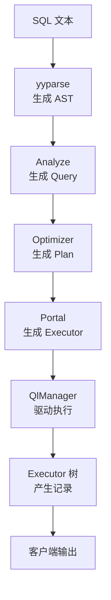
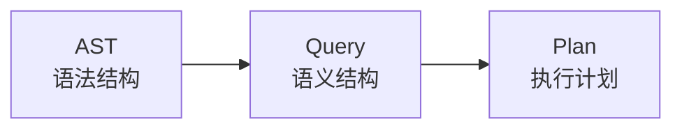

# 组件交互

## 查询处理的总调用链

**含义**：查询处理不是某一个类单独完成的，而是 `rmdb.cpp`、Analyze、Optimizer、Portal、QlManager 和 Executor 串起来的一条流水线。

**作用**：这条流水线把 SQL 文本逐步变成 AST、Query、Plan、Executor，最后变成客户端能看到的结果表格。



**场景**：用户输入 `SELECT name FROM student WHERE age > 18;` 后，这条语句会沿着上图从上到下走一遍。

## rmdb

**含义**：`rmdb.cpp` 是服务端主循环中处理 SQL 请求的入口。

**作用**：它负责接收客户端发来的 SQL 字符串，创建上下文，然后依次调用 Parser、Analyze、Optimizer、Portal 和执行层。

```cpp
// src/rmdb.cpp:235-260
YY_BUFFER_STATE buf = yy_scan_string(data_recv, scanner);
if (yyparse(scanner) == 0) {
  if (ast::parse_tree != nullptr) {
    std::shared_ptr<Query> query =
        analyze->do_analyze(std::move(ast::parse_tree));
    yy_delete_buffer(buf, scanner);
    if (query->agg_types.size() == 1 &&
        query->agg_types[0] == AGG_COUNT && query->conds.empty()) {
      ql_manager->select_fast_count_star(
          fast_count_star(query->tables[0], context), col_name, context);
    } else {
      std::shared_ptr<Plan> plan = optimizer->plan_query(query, context);
      std::shared_ptr<PortalStmt> portalStmt = portal->start(plan, context);
      portal->run(portalStmt, ql_manager.get(), &txn_id, context);
      portal->drop();
    }
  }
}
```

**输入**：`data_recv` 是客户端传来的 SQL 文本。

**输出**：普通查询输出到 `data_send`，异常会被捕获并转换成客户端可见的错误信息。

**场景**：`COUNT` 的无条件全表统计在这里有一个特殊路径，满足 `COUNT` 且没有 WHERE 条件时直接走 `fast_count_star()`，跳过普通的 Optimizer 和 Executor 树。

## Analyze 到 Optimizer

**含义**：Analyze 的输出是 `Query`，Optimizer 的输入也是 `Query`。

**作用**：Analyze 保证 Query 中的表名、列名、类型、条件都已经经过语义检查，Optimizer 才能放心地根据这些信息生成 Plan。



**场景**：`WHERE age > 18` 在 AST 中只是一个 `BinaryExpr`，Analyze 会把它转换成 `Condition`，Optimizer 再根据这个 `Condition` 判断是否能使用索引扫描。

## Optimizer 到 Portal

**含义**：Optimizer 输出的是 Plan 树，Portal 负责把 Plan 树转换成 Executor 树。

**作用**：Plan 是“计划描述”，Executor 是“可运行对象”。

**示例**：`ScanPlan(T_IndexScan)` 表示计划使用索引扫描，Portal 会把它转换成 `IndexScanExecutor`。

```cpp
// src/portal.h:196-235
std::unique_ptr<AbstractExecutor> convert_plan_executor(
    const std::shared_ptr<Plan>& plan, Context* context,
    bool gap_mode = false) {
  if (auto x = std::dynamic_pointer_cast<ProjectionPlan>(plan)) {
    return std::make_unique<ProjectionExecutor>(
        convert_plan_executor(x->subplan_, context), std::move(x->sel_cols_),
        x->limit_);
  }
  if (auto x = std::dynamic_pointer_cast<ScanPlan>(plan)) {
    if (x->tag == T_SeqScan) {
      return std::make_unique<SeqScanExecutor>(
          sm_manager_, std::move(x->tab_name_), std::move(x->conds_), context,
          gap_mode);
    }
    return std::make_unique<IndexScanExecutor>(
        sm_manager_, std::move(x->tab_name_), std::move(x->conds_),
        std::move(x->index_col_names_), context, gap_mode, x->asc_);
  }
}
```

**输入**：`plan` 是 Optimizer 生成的计划节点。

**输出**：返回一个 `AbstractExecutor` 指针，实际对象可能是 `ProjectionExecutor`、`SeqScanExecutor`、`IndexScanExecutor` 等。

## Portal 的分发

**含义**：`Portal::start()` 根据 Plan 的语句类型，决定本次请求是查询、修改、DDL 还是工具命令。

**作用**：不同语句的执行方式不同，SELECT 需要返回结果表，INSERT、DELETE、UPDATE 只需要执行一次，DDL 和工具命令直接交给 QlManager 处理。

```cpp
// src/portal.h:87-159
if (auto x = std::dynamic_pointer_cast<DMLPlan>(plan)) {
  switch (x->tag) {
    case T_select: {
      auto p = std::dynamic_pointer_cast<ProjectionPlan>(x->subplan_);
      auto root = convert_plan_executor(p, context);
      return std::make_shared<PortalStmt>(PORTAL_ONE_SELECT,
                                          std::move(show_cols),
                                          std::move(root), std::move(plan));
    }
    case T_Update: {
      auto scan = convert_plan_executor(x->subplan_, context, true);
      std::vector<Rid> rids;
      for (scan->beginTuple(); !scan->is_end(); scan->nextTuple()) {
        rids.emplace_back(scan->rid());
      }
      auto root = std::make_unique<UpdateExecutor>(...);
      return std::make_shared<PortalStmt>(PORTAL_DML_WITHOUT_SELECT,
                                          std::vector<TabCol>(),
                                          std::move(root), plan);
    }
  }
}
```

**场景**：DELETE 和 UPDATE 会先执行扫描子计划收集所有 RID (Record ID，记录标识符)，再创建真正的 DeleteExecutor 或 UpdateExecutor。

**作用**：这种“两阶段”方式把“找出要改的行”和“真正修改这些行”分开，避免边扫描边修改导致扫描状态混乱。

## Portal 到 QlManager

**含义**：`Portal::run()` 是执行阶段的最后一道分发，它根据 `PortalStmt` 的类型调用 QlManager 的不同方法。

```cpp
// src/portal.h:168-185
static void run(std::shared_ptr<PortalStmt>& portal, QlManager* ql,
                txn_id_t* txn_id, Context* context) {
  switch (portal->tag) {
    case PORTAL_ONE_SELECT:
      ql->select_from(portal->root, portal->sel_cols, context);
      break;
    case PORTAL_DML_WITHOUT_SELECT:
      QlManager::run_dml(portal->root);
      break;
    case PORTAL_MULTI_QUERY:
      ql->run_mutli_query(portal->plan, context);
      break;
    case PORTAL_CMD_UTILITY:
      ql->run_cmd_utility(portal->plan, txn_id, context);
      break;
  }
}
```

**作用**：Portal 不直接打印结果、不直接建表、不直接提交事务，它只决定应该调用 QlManager 的哪个入口。

## QlManager

**含义**：QlManager 是查询语言执行管理器，负责驱动 Executor 树，或者把 DDL 和工具命令转交给对应管理器。

**作用**：它是执行层的“司机”，Executor 是“发动机”。

| 方法 | 场景 | 作用 |
|------|------|------|
| `select_from()` | SELECT | 驱动 Executor 树并格式化输出 |
| `run_dml()` | INSERT、DELETE、UPDATE | 调用根算子 `Next()` 一次完成修改 |
| `run_mutli_query()` | CREATE、DROP | 调用 SmManager 完成 DDL |
| `run_cmd_utility()` | HELP、SHOW、DESC、事务命令 | 执行工具命令和事务控制 |

## SELECT 的执行循环

**含义**：`select_from()` 用 Volcano 迭代器循环驱动根算子，每次取一条结果记录。

```cpp
// src/execution/execution_manager.cpp:254-294
size_t num_rec = 0;
for (executorTreeRoot->beginTuple(); !executorTreeRoot->is_end();
     executorTreeRoot->nextTuple()) {
  columns.clear();
  auto Tuple = executorTreeRoot->Next();
  for (auto& col : executorTreeRoot->cols()) {
    char* rec_buf = Tuple->data + col.offset;
    if (col.type == TYPE_INT) {
      col_str = std::to_string(*(int*)rec_buf);
    } else if (col.type == TYPE_FLOAT) {
      col_str = std::to_string(*(float*)rec_buf);
    } else if (col.type == TYPE_STRING) {
      col_str = std::string((char*)rec_buf, col.len);
    }
  }
  rec_printer.print_record(columns, context);
  num_rec++;
}
```

**输入**：`executorTreeRoot` 是 Portal 构造好的根算子。

**输出**：每条记录被转成字符串后写入客户端缓冲区，最后输出记录条数。

**场景**：如果根算子是 `ProjectionExecutor`，它会继续向下拉取 `SortExecutor`、`AggregateExecutor` 或扫描算子的结果。

## DML 的执行方式

**含义**：INSERT、DELETE、UPDATE 不需要像 SELECT 一样逐行返回结果。

```cpp
// src/execution/execution_manager.cpp:342-344
void QlManager::run_dml(std::unique_ptr<AbstractExecutor>& exec) {
  exec->Next();
}
```

**作用**：DML (Data Manipulation Language，数据操纵语言) 的副作用发生在 `Next()` 内部，例如插入记录、删除记录、更新索引、写日志、加入事务写集。

**场景**：`DeleteExecutor::Next()` 会遍历 Portal 预收集的 RID 列表，而不是由 QlManager 逐条调用。

## DDL 和工具命令

**含义**：DDL (Data Definition Language，数据定义语言) 不需要 Executor 树。

```cpp
// src/execution/execution_manager.cpp:91-109
void QlManager::run_mutli_query(std::shared_ptr<Plan>& plan, Context* context) {
  if (auto x = std::dynamic_pointer_cast<DDLPlan>(plan)) {
    switch (x->tag) {
      case T_CreateTable:
        sm_manager_->create_table(x->tab_name_, x->cols_, context);
        break;
      case T_DropTable:
        sm_manager_->drop_table(x->tab_name_, context);
        break;
      case T_CreateIndex:
        sm_manager_->create_index(x->tab_name_, x->tab_col_names_, context);
        break;
    }
  }
}
```

**作用**：建表、删表、建索引、删索引这些操作直接由系统管理层 SmManager 执行，因为它们修改的是元数据和文件结构，不是普通记录流。

## 锁的交互位置

**级别**：本章主要接触的是事务级锁，由 LockManager 管理。

**范围**：扫描算子可能锁住整张表或索引间隙，DELETE 和 UPDATE 可能锁住要修改的表和相关索引间隙。

**类型**：SELECT 类扫描通常使用共享锁，DELETE 和 UPDATE 的修改路径使用排他锁，索引间隙根据 `gap_mode` 使用共享或排他间隙锁。

**生命周期**：这些锁在 Executor 构造或扫描开始前申请，通常随事务结束由事务管理器统一释放，而不是在单个 `Next()` 返回后立即释放。

**场景**：Portal 为 UPDATE 和 DELETE 调用 `convert_plan_executor(x->subplan_, context, true)`，这里的 `true` 会让扫描路径进入写间隙锁模式，为后续修改提前保护范围。

## 小结

**含义**：查询处理的组件交互可以概括为“前半段生成结构，后半段执行结构”。

**流程**：Parser 生成 AST，Analyze 生成 Query，Optimizer 生成 Plan，Portal 生成 Executor，QlManager 驱动 Executor。

**重点**：学习时不要只看单个算子，还要能说清楚这个算子是由哪个 Plan 转换来的、由谁驱动、结果被谁消费。

上一节：[05-execution-detail.md](./05-execution-detail.md) | 下一节：[07-query-processing-frame-vs-reference.md](./07-query-processing-frame-vs-reference.md)
