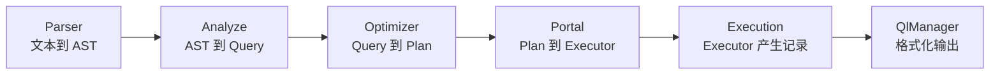

# 查询处理总结

## 本章覆盖范围

**含义**：第 5 章讲的是 SQL 从文本到执行结果的完整链路。

**范围**：本章覆盖 Parser、Analyze、Optimizer、Portal、Execution 和 QlManager 六个部分。

**重点**：Parser 是理解型内容，Analyze、Optimizer 和 Execution 是实现型内容。

## 核心数据流

**含义**：查询处理的本质是数据结构不断变形。

| 阶段 | 输入 | 输出 | 主要职责 |
|------|------|------|----------|
| Parser | SQL 文本 | AST | 识别语法结构 |
| Analyze | AST | Query | 绑定表、列、类型和条件 |
| Optimizer | Query | Plan | 决定扫描、连接、排序、聚合方式 |
| Portal | Plan | Executor | 创建可运行的算子树 |
| QlManager | Executor | 输出表格 | 驱动算子并格式化结果 |

**示例**：`SELECT name FROM student WHERE age > 18` 会依次变成 `SelectStmt`、`Query`、`ProjectionPlan + ScanPlan`、`ProjectionExecutor + SeqScanExecutor`，最后变成客户端看到的结果表。

## 和前四章的关系

**含义**：查询处理层是前四章能力的使用者。

| 已学章节 | 本章如何使用 |
|----------|--------------|
| 存储层 | 通过 BufferPoolManager 间接读写页面 |
| 记录层 | SeqScan、Insert、Delete、Update 操作 RmFileHandle 和 RmRecord |
| 索引层 | IndexScan 和索引维护操作 IxIndexHandle |
| 系统层 | Analyze、Planner、Executor 读取 DbMeta、TabMeta、ColMeta、IndexMeta |

**作用**：前四章提供“怎么存”和“有什么”，第 5 章负责把用户的 SQL 变成对这些底层结构的调用。

## 框架学习重点

**含义**：`db2026-x/` 中第 5 章对应的待实现内容很多，需要按依赖顺序学习。

| 优先级 | 模块 | 原因 |
|--------|------|------|
| 1 | Analyze 表检查、列检查、UPDATE 分支 | 没有语义检查，后续计划会拿到错误输入 |
| 2 | SeqScanExecutor | 最基础的数据读取路径 |
| 3 | ProjectionExecutor | 最简单 SELECT 需要投影输出 |
| 4 | NestedLoopJoinExecutor | 多表查询的基础连接算法 |
| 5 | SortExecutor | ORDER BY 的基础实现 |
| 6 | DeleteExecutor 和 UpdateExecutor | DML 修改路径，需要维护记录、索引、日志和事务写集 |
| 7 | IndexScanExecutor 和 PredicateManager | 依赖索引层和谓词边界分析，难度最高 |
| 8 | AggregateExecutor 和 SortMergeJoinExecutor | 聚合与高级连接能力 |

**建议**：先跑通 `SELECT col FROM table WHERE col = value`，再逐步支持索引、连接、排序、修改和聚合。

## 关键设计思路

### 语义和执行分离

**含义**：Analyze 只判断 SQL 是否合理，不读写真实记录。

**作用**：这样可以在执行前尽早发现表不存在、列不存在、类型不兼容等错误。

**示例**：`WHERE age > 'abc'` 应该在 Analyze 阶段报类型错误，而不是等 SeqScan 扫到第一条记录才发现。

### 计划和算子分离

**含义**：Plan 描述要做什么，Executor 执行具体算法。

**作用**：Optimizer 可以只生成轻量的计划树，Portal 再根据 PlanTag 创建真正的 C++ 执行对象。

**示例**：`ScanPlan(T_IndexScan)` 只是说明“用索引扫描”，真正的 B+ 树范围扫描由 `IndexScanExecutor` 完成。

### 拉取式执行

**含义**：Executor 采用 Volcano 迭代器模型，父算子主动向子算子拉取记录。

**作用**：所有算子都遵守 `beginTuple()`、`nextTuple()`、`Next()`、`is_end()` 接口，可以组合成任意树形结构。

**示例**：ProjectionExecutor 不关心下面是 SeqScan、IndexScan、Sort 还是 Aggregate，只要调用统一接口即可。

### 修改前先定位

**含义**：DELETE 和 UPDATE 先通过扫描计划收集 RID，再由修改算子逐个执行修改。

**作用**：这避免了边扫描边删除或边扫描边更新导致扫描器状态不稳定的问题。

**场景**：Portal 在构造 DeleteExecutor 或 UpdateExecutor 前，会先运行扫描子计划，把所有待修改记录的 RID 收集到向量中。

## 锁与事务提示

**级别**：本章出现的锁主要是事务级锁，具体机制会在第 6 章事务与并发中展开。

**范围**：扫描路径可能锁住表或索引间隙，修改路径可能锁住表、记录对应范围和相关索引间隙。

**类型**：普通读取通常使用共享锁，DELETE 和 UPDATE 使用排他锁，写间隙模式使用排他间隙锁。

**生命周期**：锁通常在算子构造或扫描开始时申请，并由事务结束统一释放。

**学习建议**：第 5 章只需要知道“为什么执行层会接触锁”，不用急着掌握两阶段锁协议和死锁处理。

## 常见误区

| 误区 | 正确认识 |
|------|----------|
| Parser 已经知道列是否存在 | Parser 只懂语法，列存在性由 Analyze 检查 |
| Optimizer 一定会做复杂成本估计 | RMDB 主要是规则和启发式优化，没有完整成本模型 |
| Plan 就是 Executor | Plan 是描述，Executor 才能运行 |
| `Next()` 一定返回一条记录 | DML 算子的 `Next()` 主要执行副作用，通常返回 `nullptr` |
| 索引扫描只要找到第一个键就行 | 范围查询需要上下界和剩余条件过滤 |
| 所有比较都可以用 `memcmp` | FLOAT 必须按类型比较，否则字节序不等于数值大小 |

## 本章完成后应该掌握什么

**能力 1**：能画出 SQL 从 `yyparse()` 到 `Executor::Next()` 的完整调用链。

**能力 2**：能解释 AST、Query、Plan、Executor 四种结构的区别。

**能力 3**：能说清楚 SeqScan、IndexScan、Projection、Join、Sort、Aggregate 各自负责什么。

**能力 4**：能根据框架 TODO 找到参考实现中的对应代码，并判断实现顺序。

**能力 5**：能理解执行层为什么要调用记录层、索引层、系统层和事务层。

## 下一章预告

**含义**：第 6 章会进入事务与并发控制。

**联系**：本章已经看到 InsertExecutor、DeleteExecutor、UpdateExecutor 和扫描算子会申请锁、写日志、维护事务写集。

**重点**：下一章会解释这些锁和事务写集背后的规则，例如隔离性、两阶段锁、死锁处理和并发修改保护。

上一节：[08-query-processing-api-reference.md](./08-query-processing-api-reference.md) | 下一章：[01-transaction-concurrency-overview.md](../06-transaction-concurrency/01-transaction-concurrency-overview.md)
