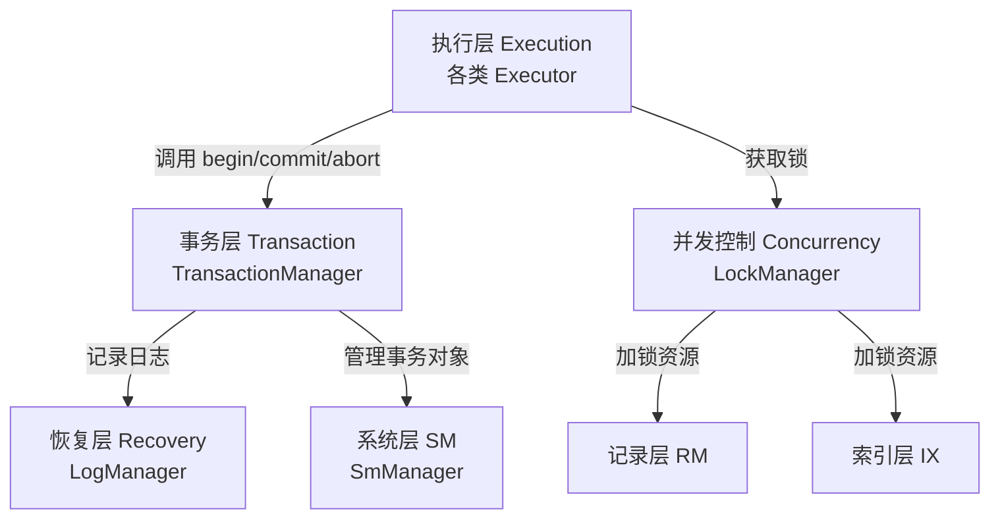
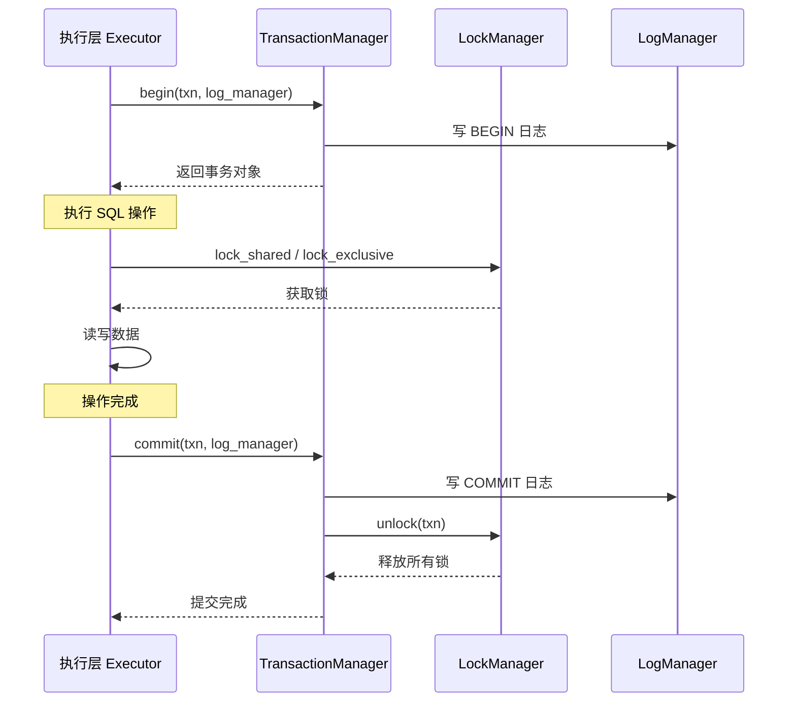

# 事务层概述

## 事务层在架构中的位置



**含义**：事务层是 DBMS 的"安全网"——保证多个用户同时操作数据库时，数据不会乱。

**作用**：保证 ACID 中的 A（原子性）、C（一致性）、I（隔离性）。

**源码**：`src/transaction/`，包含 3 个核心模块：

```
src/transaction/
├── txn_defs.h              # 事务相关类型定义
├── transaction.h            # 事务对象
├── transaction_manager.h    # 事务管理器（对外接口）
├── transaction_manager.cpp
└── concurrency/
    ├── lock_manager.h       # 锁管理器（两阶段封锁）
    └── lock_manager.cpp
```

## 核心概念

### 事务是什么

**含义**：事务是一组操作的集合，这组操作要么全部成功，要么全部失败。

**示例**：银行转账——从 A 扣 100 元，给 B 加 100 元。如果只执行了一半（扣了 A 的钱但没给 B 加上），数据库就乱了。事务保证这两步要么都做，要么都不做。

### 事务的五个状态

**源码**：`src/transaction/txn_defs.h:25`

```cpp
// src/transaction/txn_defs.h:25
enum class TransactionState { DEFAULT, GROWING, SHRINKING, COMMITTED, ABORTED };
```

```mermaid
stateDiagram-v2
    [*] --> DEFAULT : 事务开始
    DEFAULT --> GROWING : 加锁阶段
    GROWING --> SHRINKING : 释放锁阶段
    SHRINKING --> COMMITTED : 提交
    GROWING --> ABORTED : 回滚
    SHRINKING --> ABORTED : 回滚
    COMMITTED --> [*]
    ABORTED --> [*]
```

**含义**：
- **DEFAULT**：事务刚创建，还没开始操作。
- **GROWING**：增长阶段——只获取锁，不释放锁。
- **SHRINKING**：收缩阶段——只释放锁，不获取锁。
- **COMMITTED**：事务已提交，修改永久生效。
- **ABORTED**：事务已回滚，所有修改被撤销。

GROWING 和 SHRINKING 是两阶段封锁协议（2PL）的核心——事务先全部加锁，再全部释放，不允许加锁和释放锁交叉进行。

### 隔离级别

**源码**：`src/transaction/txn_defs.h:28-33`

```cpp
// src/transaction/txn_defs.h:28
enum class IsolationLevel {
  READ_UNCOMMITTED,
  REPEATABLE_READ,
  READ_COMMITTED,
  SERIALIZABLE
};
```

**含义**：隔离级别定义了事务之间互相影响的程度。级别越高，隔离性越强，但并发性能越差。

| 级别 | 脏读 | 不可重复读 | 幻读 | RMDB 使用 |
|------|------|-----------|------|----------|
| READ_UNCOMMITTED | 可能 | 可能 | 可能 | 否 |
| READ_COMMITTED | 不会 | 可能 | 可能 | 否 |
| REPEATABLE_READ | 不会 | 不会 | 可能 | 否 |
| SERIALIZABLE | 不会 | 不会 | 不会 | **默认** |

RMDB 默认使用 SERIALIZABLE（可串行化），这是最高隔离级别，保证事务并发执行的结果等同于串行执行。

## 三大核心组件

### Transaction：事务对象

**源码**：`src/transaction/transaction.h:22-99`

**含义**：Transaction 是一个事务的抽象表示。每次执行 SQL 时，系统会创建一个 Transaction 对象来跟踪这个事务的所有操作。

关键成员：

| 成员 | 类型 | 作用 |
|------|------|------|
| `txn_id_` | `txn_id_t` | 事务唯一 ID |
| `state_` | `TransactionState` | 当前状态（GROWING/SHRINKING...） |
| `isolation_level_` | `IsolationLevel` | 隔离级别 |
| `write_set_` | `deque<WriteRecord*>` | 写操作记录，用于回滚 |
| `lock_set_` | `unordered_set<LockDataId>` | 已获取的所有锁 |
| `prev_lsn_` | `lsn_t` | 最后一条日志的 LSN，用于故障恢复 |

**场景**：TransactionManager 的 `begin()` 创建它，`commit()` / `abort()` 销毁它。

### TransactionManager：事务管理器

**源码**：`src/transaction/transaction_manager.h:24-101`

**含义**：TransactionManager 是事务层对外的门面——执行层通过它来开始、提交、回滚事务。

核心方法：

| 方法 | 作用 |
|------|------|
| `begin(txn, log_manager)` | 开始事务，记录 BEGIN 日志 |
| `commit(txn, log_manager)` | 提交事务，写 COMMIT 日志，释放锁 |
| `abort(txn, log_manager)` | 回滚事务，用 write_set_ 撤销修改，释放锁 |
| `get_transaction(txn_id)` | 从全局事务表中查找事务对象 |

**场景**：被执行层的 `ExecuteEngine` 调用。

### LockManager：锁管理器

**源码**：`src/transaction/concurrency/lock_manager.h`

**含义**：LockManager 实现两阶段封锁协议（2PL），负责锁的申请、等待、释放。一个事务要读写任何数据前，必须先通过 LockManager 获取对应的锁。

核心方法：

| 方法 | 作用 |
|------|------|
| `lock_shared(txn, lock_data_id)` | 申请共享锁（读锁） |
| `lock_exclusive(txn, lock_data_id)` | 申请排他锁（写锁） |
| `lock_upgrade(txn, lock_data_id)` | 共享锁升级为排他锁 |
| `unlock(txn)` | 释放事务持有的所有锁 |

**场景**：被执行层的 InsertExecutor、DeleteExecutor、UpdateExecutor、SeqScanExecutor 等调用。

## 事务的生命周期



整个事务的生命周期就是：**开始 → 获取锁 → 执行操作 → 提交（或回滚）→ 释放锁**。

## 和前面几层的联系

**和记录层的对比**：记录层（RM）只管"怎么存、怎么取"，不关心并发。事务层在记录层之上加了并发控制——多个事务同时操作同一张表时，LockManager 保证它们不会互相干扰。

**和索引层的对比**：索引层（IX）的 B+ 树操作本身不对并发事务做保证。事务层对索引页面的修改也通过锁来保护。

**和系统层的对比**：系统层（SM）的 `sm_manager_` 指针被 TransactionManager 持有，事务通过 SM 可以访问所有管理器（RM、IX、Buffer Pool）。

## 下一节

下一节：[02-transaction-data-structures.md](./02-transaction-data-structures.md)
