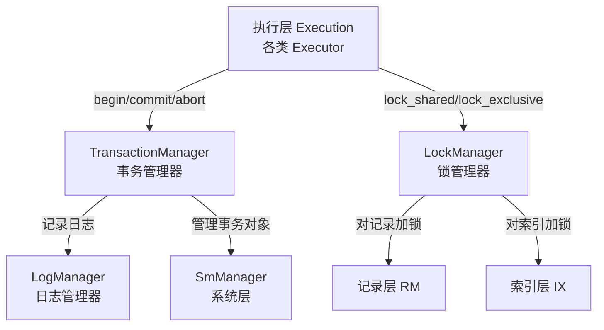
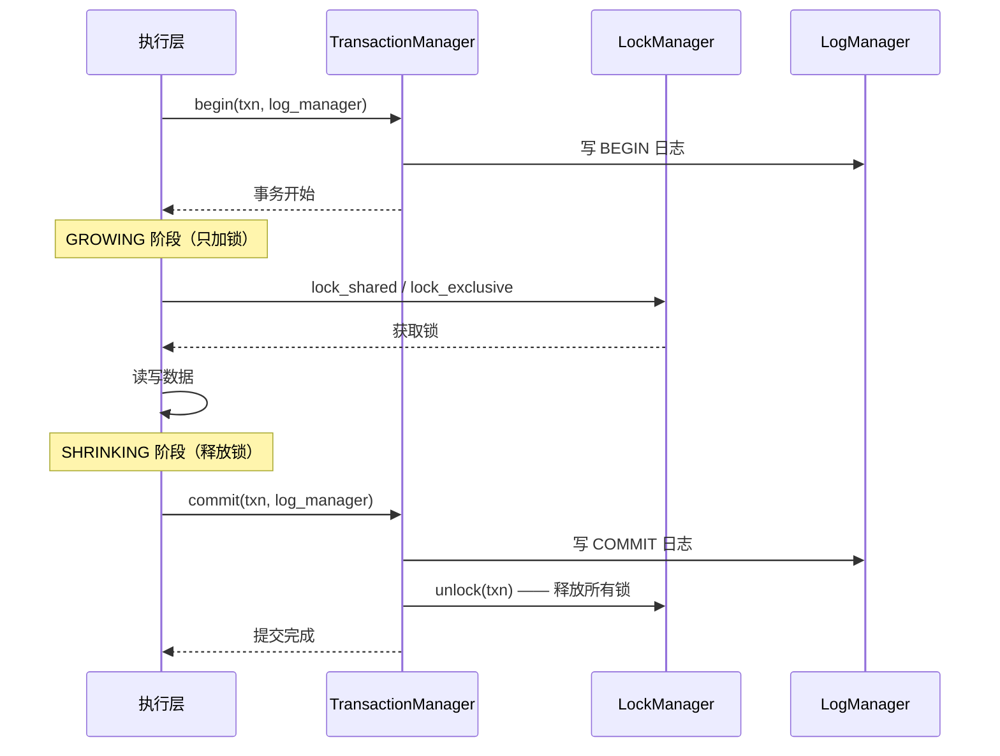

# 事务与并发概述

## 事务与并发在架构中的位置



**含义**：事务与并发控制是 DBMS 的"安全网"——保证多个用户同时操作数据库时，数据不会乱。

**作用**：保证 ACID 中的 A（原子性）、C（一致性）、I（隔离性）。D（持久性）由第 7 章的恢复层保证。

**源码**：`src/transaction/`，包含三个核心文件：

```
src/transaction/
├── txn_defs.h                  # 事务相关的所有类型定义
├── transaction.h               # 事务对象
├── transaction_manager.h       # 事务管理器（对外的门面）
├── transaction_manager.cpp
└── concurrency/
    ├── lock_manager.h          # 锁管理器（两阶段封锁）
    └── lock_manager.cpp
```

## 核心概念

### 事务的五个状态

**源码**：`src/transaction/txn_defs.h:25`

```cpp
// src/transaction/txn_defs.h:25
enum class TransactionState { DEFAULT, GROWING, SHRINKING, COMMITTED, ABORTED };
```

```mermaid
stateDiagram-v2
    [*] --> DEFAULT : 事务开始
    DEFAULT --> GROWING : 加锁阶段
    GROWING --> SHRINKING : 释放锁阶段
    SHRINKING --> COMMITTED : 提交
    GROWING --> ABORTED : 回滚
    SHRINKING --> ABORTED : 回滚
```

**含义**：GROWING 和 SHRINKING 反映了两阶段封锁协议（2PL）的核心约束——事务必须**先全部加锁（GROWING），再全部释放（SHRINKING）**，不允许加锁和释放锁交叉进行。

### 隔离级别

**源码**：`src/transaction/txn_defs.h:28-33`

RMDB 默认使用 **SERIALIZABLE**（可串行化），这是最高隔离级别，保证事务并发执行的结果等同于串行执行。

**为什么选 SERIALIZABLE**：可串行化是教学场景最安全的默认值——它用两阶段封锁 + 间隙锁彻底消除脏读、不可重复读和幻读。实际数据库（如 PostgreSQL）默认用 READ COMMITTED，在并发性能和数据一致性之间做权衡。RMDB 作为教学系统选择最严格级别，让学习者先理解"完全正确"的实现，再在实际工程中降级。

### 写操作记录与回滚

**源码**：`src/transaction/txn_defs.h:49-101`

**含义**：WriteRecord 记录事务的每次写操作（INSERT、DELETE、UPDATE），保存操作前的旧值。

**作用**：当事务需要回滚时，TransactionManager 遍历 `write_set_` 中的 WriteRecord，反向撤销每个操作——INSERT 的回滚是 DELETE，DELETE 的回滚是 INSERT，UPDATE 的回滚是恢复旧值。

| 操作 | 回滚时做什么 | 记录内容 |
|------|------------|---------|
| INSERT | DELETE | 插入的 Rid + 插入的记录 |
| DELETE | INSERT | 删除的 Rid + 被删记录的原值 |
| UPDATE | 恢复旧值 | Rid + 旧记录 + 新记录 |

## 三大核心组件

### Transaction：事务对象

**源码**：`src/transaction/transaction.h:22-99`

**含义**：Transaction 是事务的抽象表示，跟踪一个事务从开始到结束的所有状态。

关键成员：

| 成员 | 类型 | 作用 |
|------|------|------|
| `txn_id_` | `txn_id_t` | 事务唯一 ID |
| `state_` | `TransactionState` | 当前状态 |
| `write_set_` | `deque<WriteRecord*>` | 写操作记录，回滚时逆向执行 |
| `lock_set_` | `unordered_set<LockDataId>` | 已获取的所有锁 |
| `prev_lsn_` | `lsn_t` | 最后一条日志 LSN，关联恢复层 |
| `index_latch_page_set_` | `deque<Page*>` | 事务加锁的索引页面 |
| `index_deleted_page_set_` | `deque<Page*>` | 事务删除的索引页面 |

### TransactionManager：事务管理器

**源码**：`src/transaction/transaction_manager.h:24-101`

**含义**：TransactionManager 是事务层对外的门面。

核心方法：

| 方法 | 作用 |
|------|------|
| `begin(txn, log_manager)` | 开始事务，记录 BEGIN 日志，分配 txn_id |
| `commit(txn, log_manager)` | 提交事务，写 COMMIT 日志，释放锁 |
| `abort(txn, log_manager)` | 回滚事务，遍历 write_set_ 撤销修改，释放锁 |
| `get_transaction(txn_id)` | 从全局事务表 txn_map 查找事务 |

**场景**：被执行引擎在每条 SQL 执行前后调用。

### LockManager：锁管理器

**源码**：`src/transaction/concurrency/lock_manager.h`

**含义**：LockManager 实现两阶段封锁协议（2PL）。

核心方法：

| 方法 | 作用 |
|------|------|
| `lock_shared(txn, lock_data_id)` | 申请共享锁（读锁） |
| `lock_exclusive(txn, lock_data_id)` | 申请排他锁（写锁） |
| `unlock(txn)` | 释放事务持有的所有锁 |

锁升级不需要单独的接口——当事务对同一资源先申请 S 锁、再申请 X 锁时，LockManager 内部通过 `check_lock` 判定兼容性并处理升级。

锁的粒度分三档：

| 粒度 | LockDataType | 锁住的资源 |
|------|-------------|-----------|
| 表级锁 | `TABLE` | 整张表 |
| 行级锁 | `RECORD` | 单个记录（page_no + slot_no） |
| 间隙锁 | `GAP` | 索引键之间的范围（防幻读） |

## 事务的生命周期



## 和前面几层的联系

| 前面学的层 | 被事务层怎么用 |
|-----------|--------------|
| 系统层（SM） | TransactionManager 持有 `sm_manager_` 指针，通过它访问 RM 和 IX |
| 索引层（IX） | 事务对索引页面的修改需要加 Page 级读写锁（RWLatch），记录在 `index_latch_page_set_` 中。注意这里存的是存储层页面锁，而不是事务级锁 |
| 记录层（RM） | LockManager 对记录（Rid）加行级锁，WriteRecord 中记录 Rid 和 RmRecord |
| 存储层（Storage） | 日志持久化最终通过 BufferPoolManager 刷盘 |

上一节：[09-query-processing-summary.md](../05-query-processing/09-query-processing-summary.md) | 下一节：[02-transaction-data-structures.md](./02-transaction-data-structures.md)
