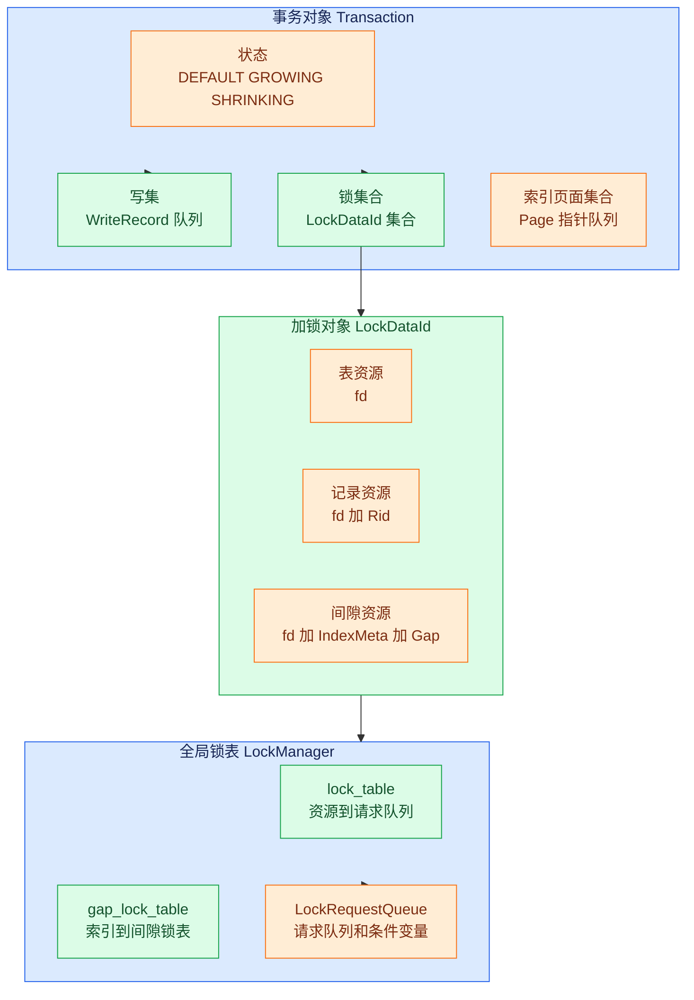

# 事务数据结构

## 数据结构总览

**含义**：事务层的数据结构可以分成事务对象、写集、锁对象和锁表四组。

**作用**：事务对象记录“这个事务做过什么”，锁表记录“这个资源现在被谁锁住”。



## Transaction

**含义**：`Transaction` 是一个事务在内存中的运行时对象。

**作用**：它集中保存事务编号、事务状态、隔离级别、写操作记录、已持有锁和恢复层日志位置。

**场景**：执行层执行一条 SQL 时会通过 `Context` 携带当前事务，Insert、Delete、Update 和 Scan 算子都会读取或修改这个对象。

```cpp
// src/transaction/transaction.h:21-31
class Transaction {
 public:
  explicit Transaction(txn_id_t txn_id, IsolationLevel isolation_level =
                                            IsolationLevel::SERIALIZABLE)
      : state_(TransactionState::DEFAULT),
        isolation_level_(isolation_level),
        txn_id_(txn_id) {
    write_set_ = std::make_shared<std::deque<WriteRecord*> >();
    lock_set_ = std::make_shared<std::unordered_set<LockDataId> >();
    index_latch_page_set_ = std::make_shared<std::deque<Page*> >();
    index_deleted_page_set_ = std::make_shared<std::deque<Page*> >();
```

**`explicit` 的作用**：阻止编译器用 `txn_id_t` 隐式构造 `Transaction` 对象。比如 `void foo(Transaction t)` 被调用时写 `foo(123)` 不会悄悄编译通过——必须有显式的 `foo(Transaction(123))`。这避免了无意的类型转换，是 C++ 单参数构造函数的惯用安全写法。

**示例**：事务 T1 执行 `UPDATE student SET age = 19 WHERE id = 1` 时，`txn_id_` 标识 T1，`write_set_` 记录旧记录，`lock_set_` 记录 T1 拿到的表锁、行锁或间隙锁。

**输入**：构造函数输入 `txn_id` 和可选的 `isolation_level`。

**输出**：构造函数输出一个处于 `DEFAULT` 状态的新事务对象。

## TransactionState

**含义**：`TransactionState` 表示事务当前处于两阶段封锁协议的哪个阶段。

**作用**：它阻止事务在释放锁之后再次申请新锁。

```cpp
// src/transaction/txn_defs.h:23-24
enum class TransactionState { DEFAULT, GROWING, SHRINKING, COMMITTED, ABORTED };
```

**示例**：T1 第一次申请锁时从 `DEFAULT` 进入 `GROWING`，第一次释放锁时进入 `SHRINKING`，提交后进入 `COMMITTED`。

## 两阶段封锁协议（2PL）

**定义**：两阶段封锁协议（Two-Phase Locking, 2PL）是保证事务调度可串行化的经典并发控制协议。核心规则：**每个事务的加锁和释放锁操作必须分成两个不重叠的阶段**，不允许加锁和释放锁交叉进行。

**两个阶段**：

- **GROWING（增长阶段）**：事务只能申请锁，不能释放任何锁。对应 `TransactionState::GROWING`。
- **SHRINKING（收缩阶段）**：事务只能释放锁，不能再申请新锁。对应 `TransactionState::SHRINKING`。

**锁点**：GROWING 阶段中最后一把锁申请完毕的时刻称为"锁点"——事务在此刻持有的锁数量达到峰值。

**没有 2PL 会出现什么问题**：如果事务边加锁边释放，就可能出现不可串行化的调度。下面用一个转账场景说明。

假设账户 A 余额 100，账户 B 余额 200。T1 从 A 转 100 到 B，T2 统计两个账户的总余额：

```
正确逻辑：无论 T1 在 T2 之前还是之后执行，总余额都应该是 300
```

如果**没有 2PL**，T1 可以边加锁边释放：

| 步骤 | T1（转账 100） | T2（统计总余额） |
|------|---------------|-----------------|
| ① | 加 X 锁，读 A=100 | |
| ② | 写 A=0，释放 A 的 X 锁 | |
| ③ | | 加 S 锁，读 A=0 |
| ④ | 加 X 锁，读 B=200 | |
| ⑤ | | 加 S 锁，读 B=200 |
| ⑥ | 写 B=300，释放 B 的 X 锁 | |
| ⑦ | | T2 算出 total = 0 + 200 = **200** ❌ |

T2 读到了"中间状态"——A 已被扣减（0）但 B 还没加上（200）。实际应该是 300，T2 却算出了 200。这个调度**不等价于任何串行执行**（T1→T2 应得 300，T2→T1 也应得 300）。

如果**有 2PL**，T1 必须持有所有锁直到不再需要新锁为止：

| 步骤 | T1（持有 A、B 的 X 锁） | T2（等待） |
|------|------------------------|-----------|
| ① | 加 X 锁，读 A=100 | |
| ② | 写 A=0 | |
| ③ | 加 X 锁，读 B=200 | 申请 S 锁读 A → **阻塞等待** |
| ④ | 写 B=300 | |
| ⑤ | 提交，释放 A 和 B 的 X 锁 | |
| ⑥ | | 加 S 锁，读 A=0 |
| ⑦ | | 加 S 锁，读 B=300 |
| ⑧ | | T2 算出 total = 0 + 300 = **300** ✅ |

T2 要么在 T1 之前执行（读到旧值 100+200=300），要么在 T1 之后执行（读到新值 0+300=300），无论哪种结果都正确。这就是 2PL 保证的意义。

**为什么 2PL 能保证可串行化**：如果两个事务 T1 和 T2 存在冲突操作（比如 T1 写、T2 读同一条记录），冲突操作的先后顺序由锁的获取顺序决定。2PL 保证这个顺序在事务间形成偏序关系，不存在循环依赖，因此并发调度等价于某种串行执行。

**RMDB 中的生命周期**：

1. `DEFAULT → GROWING`：事务首次申请锁，进入增长阶段
2. `GROWING → SHRINKING`：事务首次释放锁，进入收缩阶段，**此后禁止再申请新锁**
3. `SHRINKING → COMMITTED`：提交，释放全部剩余锁
4. `GROWING / SHRINKING → ABORTED`：回滚，释放全部锁

**严格两阶段封锁（Strict 2PL）**：RMDB 实际采用严格 2PL——所有排他锁（X 锁）**一直持有到事务提交或回滚**，不在 SHRINKING 阶段提前释放。好处是避免了**级联回滚**：如果 T1 释放 X 锁后、提交前崩溃，读取过 T1 脏数据的 T2 也必须回滚。严格 2PL 保证只有已提交事务的数据才能被其他事务读到。

## WriteRecord

**含义**：`WriteRecord` 是事务写集中的一条撤销记录。

**作用**：它保存一次 INSERT、DELETE 或 UPDATE 的必要信息，让事务回滚时能反向恢复数据。

**场景**：InsertExecutor、DeleteExecutor 和 UpdateExecutor 在真实修改记录后调用 `append_write_record` 把写操作追加到事务写集中。

```cpp
// src/transaction/txn_defs.h:49-77
class WriteRecord {
 public:
  WriteRecord() = default;

  // constructor for insert operation
  WriteRecord(WType wtype, const Rid& rid, const RmRecord& record,
              std::string tab_name)
      : wtype_(wtype),
        tab_name_(std::move(tab_name)),
        rid_(rid),
        record_(record) {}

  // constructor for delete operation
  WriteRecord(WType wtype, std::string tab_name, const Rid& rid,
              const RmRecord& record)
      : wtype_(wtype),
        tab_name_(std::move(tab_name)),
        rid_(rid),
        record_(record) {}

  // constructor for update operation
  WriteRecord(WType wtype, std::string tab_name, const Rid& rid,
              const RmRecord& old_record, const RmRecord& new_record,
              bool is_set_index_key)
      : wtype_(wtype),
        tab_name_(std::move(tab_name)),
        rid_(rid),
        record_(old_record),
        updated_record_(new_record),
        is_set_index_key_(is_set_index_key) {}
```

**`std::move` 的作用**：`tab_name` 是按值传入的 `std::string` 参数，在函数体内它是一个**左值**。如果不加 `std::move`，`tab_name_(tab_name)` 会触发 string 的**拷贝构造**——分配新内存、逐字符复制一遍。加上 `std::move` 后，`tab_name_(std::move(tab_name))` 触发的是 string 的**移动构造**——只把指针"过户"给 `tab_name_`，不复制底层数据。对于表名这种短字符串开销不大，但这个写法是 C++ 中对按值传入的字符串参数的标准优化惯例，避免无谓的深拷贝。

**三个构造方法分别用于什么场景**：WriteRecord 有三个带参构造方法，分别对应 INSERT、DELETE 和 UPDATE。

| 构造方法 | 参数 | 适用场景 | 原因 |
|---------|------|---------|------|
| 第一个 | `wtype, rid, record, tab_name` | INSERT | 记录插入的数据。参数顺序：先 `rid, record` 定位，再 `tab_name` 压尾 |
| 第二个 | `wtype, tab_name, rid, record` | DELETE | 记录被删的数据。注意与 INSERT 构造方法参数**顺序不同**——`tab_name` 提到了 `rid` 前面 |
| 第三个 | `wtype, tab_name, rid, old_record, new_record, is_set_index_key` | UPDATE | 需要**新旧两条记录**——`old_record` 用于回滚（恢复旧值），`new_record` 用于判断改了什么。`is_set_index_key` 标记是否改到了索引列，回滚时需要同步恢复索引 |

如果你在阅读执行器源码时看到 `append_write_record(...)` 调用，InsertExecutor 用第一个，DeleteExecutor 用第二个，UpdateExecutor 用第三个。

**示例**：UPDATE 把 age 从 18 改成 19 时，`record_` 保存旧记录，`updated_record_` 保存新记录，`is_set_index_key_` 表示是否改到了索引列。

## LockDataId

**含义**：`LockDataId` 是被加锁资源的唯一标识。

**作用**：它把表、记录和间隙统一包装成锁表中的 key。

**场景**：LockManager 每次申请锁时都会先构造一个 `LockDataId`，再用它查找或创建锁请求队列。

```cpp
// src/transaction/txn_defs.h:269-308
class LockDataId {
 public:
  LockDataId(int fd, LockDataType type) {
    assert(type == LockDataType::TABLE);
    fd_ = fd;
    type_ = type;
    rid_.page_no = -1;
    rid_.slot_no = -1;
  }

  LockDataId(int fd, const Rid& rid, LockDataType type) {
    assert(type == LockDataType::RECORD);
    fd_ = fd;
    rid_ = rid;
    type_ = type;
  }

  LockDataId(int fd, IndexMeta& index_meta, Gap& gap, LockDataType type) {
    assert(type == LockDataType::GAP);
    fd_ = fd;
    index_meta_ = index_meta;
    gap_ = std::move(gap);
    type_ = type;
  }
```

**示例**：表级锁只需要表文件描述符 `fd`，记录级锁需要 `fd + Rid`，间隙锁需要 `fd + IndexMeta + Gap`。

**间隙（Gap）是什么**：间隙是索引中**两条已有记录之间的"空档"**。以 B+ 树索引为例，假设 `age` 列上建了索引，当前已有记录的值是 20、30、40：

```
索引中实际存在的键：        20      30      40
                     ↑       ↑       ↑
间隙（不存在的范围）： (-∞,20) (20,30) (30,40) (40,+∞)
```

间隙锁加的正是这些"不存在但可以被插入"的范围。

**为什么要锁间隙**：防止**幻读**。看这个场景：

| 步骤 | T1（统计 age<25 的人数） | T2（插入新学生） |
|------|------------------------|-----------------|
| ① | `SELECT COUNT(*) WHERE age < 25` → 扫到 age=20 | |
| ② | | `INSERT INTO student VALUES (..., age=25)` — 恰好落在 T1 的扫描范围内 |
| ③ | T1 再次扫描同范围 → 多了一行！之前没看到的行"凭空出现"了 | |

如果不锁间隙，T1 在一个事务内两次读取同一范围，结果不一样——这就是幻读。**锁住间隙后**，T2 在 T1 提交前无法向 (20, 30) 范围内插入任何数据，T1 的两次读取结果一致。

**间隙锁在 LockDataId 中的体现**：间隙锁的 LockDataId 除了 `fd`（锁定哪个表）之外还需要两个额外字段——`IndexMeta` 指示在哪个索引上加间隙锁，`Gap` 定义间隙的左右边界。这样同一个表的不同索引可以独立地锁住各自的间隙范围。

## LockRequest

**含义**：`LockRequest` 表示某个事务对某个资源的一次加锁申请。

**作用**：它记录申请者、申请的锁类型以及这个申请是否已经被授权。

```cpp
// src/transaction/concurrency/lock_manager.h:35-44
class LockRequest {
 public:
  LockRequest(txn_id_t txn_id, LockMode lock_mode, bool granted = false)
      : txn_id_(txn_id), lock_mode_(lock_mode), granted_(granted) {}

  txn_id_t txn_id_;
  LockMode lock_mode_;
  bool granted_;
};
```

**示例**：T1 已经拿到记录 R 的共享锁，队列里会有一条 `txn_id_ = T1`、`lock_mode_ = SHARED`、`granted_ = true` 的请求。

## LockRequestQueue

**含义**：`LockRequestQueue` 是同一个资源上的所有锁请求队列。

**作用**：它维护当前资源的整体锁模式、等待队列、条件变量、共享锁数量、意向排他锁数量和最老事务编号。

```cpp
// src/transaction/concurrency/lock_manager.h:46-59
class LockRequestQueue {
 public:
  std::list<LockRequest> request_queue_;
  std::condition_variable cv_;
  GroupLockMode group_lock_mode_ = GroupLockMode::NON_LOCK;
  bool upgrading_ = false;
  int shared_lock_num_ = 0;
  int IX_lock_num_ = 0;
  txn_id_t oldest_txn_id_ = INT32_MAX;
};
```

**条件变量 `cv_` 是什么**：条件变量是 C++ 标准库提供的**线程等待/唤醒机制**。它的核心操作只有两个：

- `cv_.wait(lock, 条件)` — 当前线程**休眠**，直到"条件"满足且被唤醒
- `cv_.notify_all()` — **唤醒**所有在这个 `cv_` 上休眠的线程

**为什么需要条件变量**：假设 T1 持有记录 R 的 X 锁，T2 也想拿 R 的锁。T2 有两种选择：

| 策略 | 做法 | 问题 |
|------|------|------|
| 忙等（busy-wait） | T2 反复检查"锁释放了吗？" | CPU 空转，浪费资源 |
| 条件变量（condition variable） | T2 在 `cv_` 上休眠，等 T1 释放锁后唤醒 T2 | CPU 可以处理其他事务 |

**在 LockManager 中的工作流程**（具体代码见 [04-lock-manager.md](./04-lock-manager.md)）：

1. T1 持有记录 R 的 X 锁，`group_lock_mode_ = X`
2. T2 想读 R，发现冲突 → 在 `cv_` 上调用 `cv_.wait()`，**线程休眠**
3. T1 提交，调用 `unlock()` → 释放锁 → 调用 `cv_.notify_all()` **唤醒 T2**
4. T2 被唤醒后重新检查：X 锁已释放 → 成功拿到 S 锁

类比理解：餐厅等位系统。没有叫号器时你得站在门口反复问"有座了吗"（忙等）。有叫号器时你拿了号就能在外面休息，服务员叫到你的号时你才进去（条件变量）。`cv_` 就是那个叫号器，每个 LockRequestQueue 有一个。

**`cv_` 为什么放在 LockRequestQueue 里**：每个被锁的资源（一张表、一条记录、一个间隙）各有一个队列，等待这个资源的线程都在这个队列的 `cv_` 上休眠。这样释放锁时只需唤醒等这个资源的线程，不会惊动无关线程。

**示例**：如果某张表上已有多个 IS 锁和一个 IX 锁，队列的 `group_lock_mode_` 会合成为 `IX`，后续表级 X 锁必须等待或触发死锁预防。

## 意向锁（Intention Lock）

**问题**：为什么要多出 IS、IX、SIX 这三种锁？只用 S 和 X 不行吗？

假设没有意向锁，DBMS 只支持表级 S/X 锁和行级 S/X 锁。现在 T1 要扫描整张表，它需要加**表级 S 锁**。但 T2 已经在修改表中的某一行，持有**行级 X 锁**。T1 怎么知道表里有没有行级锁在冲突？唯一的办法是**遍历表中所有行**检查锁状态——这在有百万行数据时完全不可行。

**解决**：意向锁是一个"向上通知"机制——事务在对行加锁之前，先在表上加一个意向锁，声明"我打算在里面做某种操作"。这样其他事务想锁整张表时，只需要检查表级锁就能判断是否冲突，不用逐行扫描。

**三种意向锁**：

| 意向锁 | 全称 | 含义 | 典型场景 |
|--------|------|------|---------|
| IS | Intention Shared | "我打算在里面的某些行上加 S 锁" | `SELECT ... WHERE id = 1`（只读一行） |
| IX | Intention Exclusive | "我打算在里面的某些行上加 X 锁" | `UPDATE ... WHERE id = 1`（修改一行） |
| SIX | Shared + Intention Exclusive | "我要读整张表（S），同时还要改其中几行（IX）" | `UPDATE ... WHERE age > 20`（扫描全表，改其中部分行） |

**"意向"怎么理解**：意向锁不是你真正做的那件事，而是你**提前告诉别人你打算做什么**。类比图书馆：

- 你想借走一本书（行级 X 锁），进馆时在门口登记"我来借书的"（表级 IX 锁）。后面来的人看到登记就知道有人在借书，不能直接把整个馆关了（表级 X 锁被阻止）。
- 你想在馆里自习（行级 S 锁），门口登记"我来阅读的"（表级 IS 锁）。其他人也可以自习，但不能有人进来把馆关了。

**相容矩阵**：意向锁之间基本都相容（IS 和 IX 不冲突，因为不同行各自加锁），但意向锁与真正的表级 S/X 锁有冲突：

|      | IS | IX | S | SIX | X |
|------|----|----|---|-----|---|
| IS   | ✅ | ✅ | ✅ | ✅ | ❌ |
| IX   | ✅ | ✅ | ❌ | ❌ | ❌ |
| S    | ✅ | ❌ | ✅ | ❌ | ❌ |
| SIX  | ✅ | ❌ | ❌ | ❌ | ❌ |
| X    | ❌ | ❌ | ❌ | ❌ | ❌ |

关键行：IX 与表级 S **不兼容**——如果有人在改行，你不能对整张表加 S 锁（因为你会读到未提交的修改）。IS 与 IX **兼容**——有人读行和有人改行可以在同一张表内共存。

**同一张表上可以有多个同类型的意向锁吗？** 可以。意向锁只表示"我打算在里面做某种操作"，真正的冲突在行级判断。

- 多个 IS：✅ 一百个人都在读不同的行，每人加 IS，互不干扰
- 多个 IX：✅ 一百个人都在改不同的行，每人加 IX，只要行级 X 锁不冲突就行
- 多个 SIX：✅ 但要注意 SIX 内含 S，所以 SIX 之间互斥（S 与 S 相容但 SIX 中的 S 部分与 IX 部分互斥……实际上从矩阵看 SIX ⊥ SIX = ❌）

关键理解：意向锁是表级的"路标"，不是真正的通行证。**真正的冲突裁决在行级锁上**。表级意向锁相容不代表行级操作一定相容——两个人都拿了 IX，但如果他们想改同一行，行级 X 锁会让他们排队。

## 锁说明

**级别**：本节讨论的是事务级锁，而不是存储层 Page 级 RLatch/WLatch。

**范围**：锁资源可以是一整张表、单条记录或某个索引条件对应的间隙范围。

**类型**：锁类型包括 IS、IX、S、SIX 和 X，其中 S 是共享读锁，X 是排他写锁，IS 和 IX 是多粒度锁中的意向锁。

**生命周期**：锁在执行层算子读取或修改前申请，记录在事务的 `lock_set_` 中，最后由 commit 或 abort 统一释放。

上一节：[01-transaction-concurrency-overview.md](./01-transaction-concurrency-overview.md) | 下一节：[03-transaction-manager.md](./03-transaction-manager.md)
