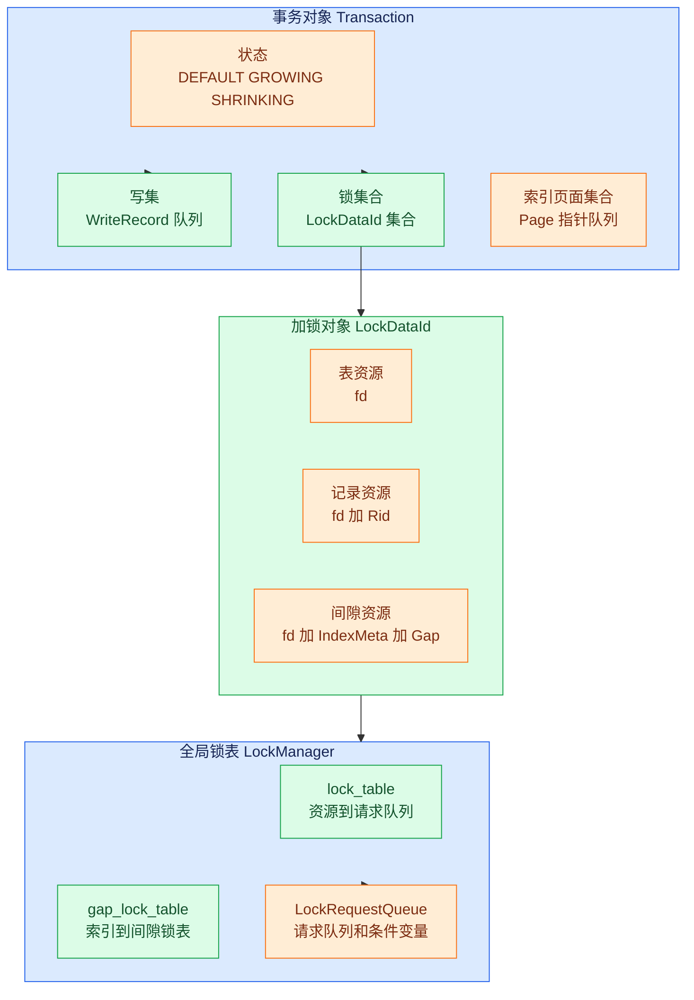

# 事务数据结构

## 数据结构总览

**含义**：事务层的数据结构可以分成事务对象、写集、锁对象和锁表四组。

**作用**：事务对象记录“这个事务做过什么”，锁表记录“这个资源现在被谁锁住”。



## Transaction

**含义**：`Transaction` 是一个事务在内存中的运行时对象。

**作用**：它集中保存事务编号、事务状态、隔离级别、写操作记录、已持有锁和恢复层日志位置。

**场景**：执行层执行一条 SQL 时会通过 `Context` 携带当前事务，Insert、Delete、Update 和 Scan 算子都会读取或修改这个对象。

```cpp
// src/transaction/transaction.h:21-31
class Transaction {
 public:
  explicit Transaction(txn_id_t txn_id, IsolationLevel isolation_level =
                                            IsolationLevel::SERIALIZABLE)
      : state_(TransactionState::DEFAULT),
        isolation_level_(isolation_level),
        txn_id_(txn_id) {
    write_set_ = std::make_shared<std::deque<WriteRecord*> >();
    lock_set_ = std::make_shared<std::unordered_set<LockDataId> >();
    index_latch_page_set_ = std::make_shared<std::deque<Page*> >();
    index_deleted_page_set_ = std::make_shared<std::deque<Page*> >();
```

**示例**：事务 T1 执行 `UPDATE student SET age = 19 WHERE id = 1` 时，`txn_id_` 标识 T1，`write_set_` 记录旧记录，`lock_set_` 记录 T1 拿到的表锁、行锁或间隙锁。

**输入**：构造函数输入 `txn_id` 和可选的 `isolation_level`。

**输出**：构造函数输出一个处于 `DEFAULT` 状态的新事务对象。

## TransactionState

**含义**：`TransactionState` 表示事务当前处于两阶段封锁协议的哪个阶段。

**作用**：它阻止事务在释放锁之后再次申请新锁。

```cpp
// src/transaction/txn_defs.h:23-24
enum class TransactionState { DEFAULT, GROWING, SHRINKING, COMMITTED, ABORTED };
```

**示例**：T1 第一次申请锁时从 `DEFAULT` 进入 `GROWING`，第一次释放锁时进入 `SHRINKING`，提交后进入 `COMMITTED`。

## WriteRecord

**含义**：`WriteRecord` 是事务写集中的一条撤销记录。

**作用**：它保存一次 INSERT、DELETE 或 UPDATE 的必要信息，让事务回滚时能反向恢复数据。

**场景**：InsertExecutor、DeleteExecutor 和 UpdateExecutor 在真实修改记录后调用 `append_write_record` 把写操作追加到事务写集中。

```cpp
// src/transaction/txn_defs.h:48-77
class WriteRecord {
 public:
  WriteRecord() = default;

  WriteRecord(WType wtype, const Rid& rid, const RmRecord& record,
              std::string tab_name)
      : wtype_(wtype),
        tab_name_(std::move(tab_name)),
        rid_(rid),
        record_(record) {}

  WriteRecord(WType wtype, std::string tab_name, const Rid& rid,
              const RmRecord& old_record, const RmRecord& new_record,
              bool is_set_index_key)
      : wtype_(wtype),
        tab_name_(std::move(tab_name)),
        rid_(rid),
        record_(old_record),
        updated_record_(new_record),
        is_set_index_key_(is_set_index_key) {}
```

**示例**：UPDATE 把 age 从 18 改成 19 时，`record_` 保存旧记录，`updated_record_` 保存新记录，`is_set_index_key_` 表示是否改到了索引列。

## LockDataId

**含义**：`LockDataId` 是被加锁资源的唯一标识。

**作用**：它把表、记录和间隙统一包装成锁表中的 key。

**场景**：LockManager 每次申请锁时都会先构造一个 `LockDataId`，再用它查找或创建锁请求队列。

```cpp
// src/transaction/txn_defs.h:269-308
class LockDataId {
 public:
  LockDataId(int fd, LockDataType type) {
    assert(type == LockDataType::TABLE);
    fd_ = fd;
    type_ = type;
    rid_.page_no = -1;
    rid_.slot_no = -1;
  }

  LockDataId(int fd, const Rid& rid, LockDataType type) {
    assert(type == LockDataType::RECORD);
    fd_ = fd;
    rid_ = rid;
    type_ = type;
  }

  LockDataId(int fd, IndexMeta& index_meta, Gap& gap, LockDataType type) {
    assert(type == LockDataType::GAP);
    fd_ = fd;
    index_meta_ = index_meta;
    gap_ = std::move(gap);
    type_ = type;
  }
```

**示例**：表级锁只需要表文件描述符 `fd`，记录级锁需要 `fd + Rid`，间隙锁需要 `fd + IndexMeta + Gap`。

## LockRequest

**含义**：`LockRequest` 表示某个事务对某个资源的一次加锁申请。

**作用**：它记录申请者、申请的锁类型以及这个申请是否已经被授权。

```cpp
// src/transaction/concurrency/lock_manager.h:35-44
class LockRequest {
 public:
  LockRequest(txn_id_t txn_id, LockMode lock_mode, bool granted = false)
      : txn_id_(txn_id), lock_mode_(lock_mode), granted_(granted) {}

  txn_id_t txn_id_;
  LockMode lock_mode_;
  bool granted_;
};
```

**示例**：T1 已经拿到记录 R 的共享锁，队列里会有一条 `txn_id_ = T1`、`lock_mode_ = SHARED`、`granted_ = true` 的请求。

## LockRequestQueue

**含义**：`LockRequestQueue` 是同一个资源上的所有锁请求队列。

**作用**：它维护当前资源的整体锁模式、等待队列、条件变量、共享锁数量、意向排他锁数量和最老事务编号。

```cpp
// src/transaction/concurrency/lock_manager.h:46-59
class LockRequestQueue {
 public:
  std::list<LockRequest> request_queue_;
  std::condition_variable cv_;
  GroupLockMode group_lock_mode_ = GroupLockMode::NON_LOCK;
  bool upgrading_ = false;
  int shared_lock_num_ = 0;
  int IX_lock_num_ = 0;
  txn_id_t oldest_txn_id_ = INT32_MAX;
};
```

**示例**：如果某张表上已有多个 IS 锁和一个 IX 锁，队列的 `group_lock_mode_` 会合成为 `IX`，后续表级 X 锁必须等待或触发死锁预防。

## 锁说明

**级别**：本节讨论的是事务级锁，而不是存储层 Page 级 RLatch/WLatch。

**范围**：锁资源可以是一整张表、单条记录或某个索引条件对应的间隙范围。

**类型**：锁类型包括 IS、IX、S、SIX 和 X，其中 S 是共享读锁，X 是排他写锁，IS 和 IX 是多粒度锁中的意向锁。

**生命周期**：锁在执行层算子读取或修改前申请，记录在事务的 `lock_set_` 中，最后由 commit 或 abort 统一释放。

上一节：[01-transaction-concurrency-overview.md](./01-transaction-concurrency-overview.md) | 下一节：[03-transaction-manager.md](./03-transaction-manager.md)
