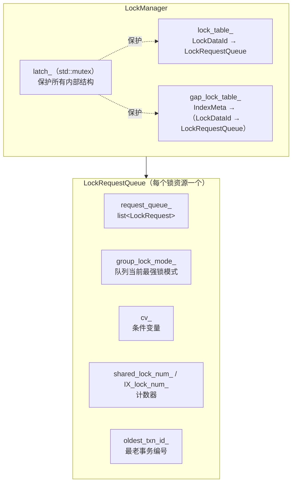
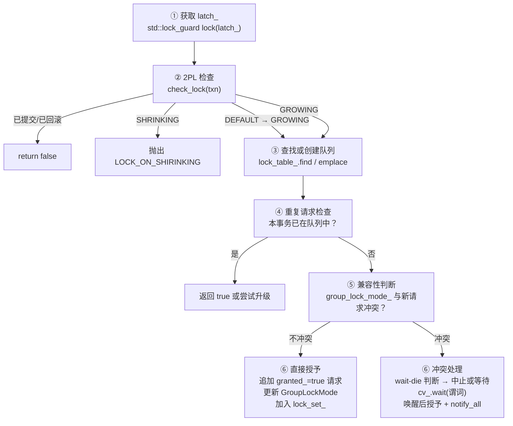

# 锁管理器

## 架构总览

**含义**：`LockManager` 是事务层最核心的执行组件。它不是简单的"锁表"，而是一个**带冲突仲裁和等待机制的并发控制引擎**。

**作用**：每个 `lock_*` 方法内部执行同一套流程——获取内部互斥锁、检查 2PL 状态、查找或创建锁请求队列、判断兼容性、执行 wait-die 死锁预防、通过条件变量等待或直接授予。

**场景**：执行层的扫描算子和修改算子在访问记录前调用 LockManager 申请锁，事务提交或回滚时调用 unlock 释放。

**内部数据结构**：

```cpp
// src/transaction/concurrency/lock_manager.h:62-98
class LockManager {
  // ... 公开方法 ...

 private:
  std::mutex latch_;                          // 保护锁表不受并发破坏
  std::unordered_map<LockDataId, LockRequestQueue> lock_table_;  // 主锁表
  std::unordered_map<IndexMeta,
                     std::unordered_map<LockDataId, LockRequestQueue>>
      gap_lock_table_;                        // 间隙锁表（两层索引）
};
```



**两个锁表的区别**：

| | `lock_table_` | `gap_lock_table_` |
|---|---|---|
| 结构 | 单层：`LockDataId → Queue` | 双层：`IndexMeta → (LockDataId → Queue)` |
| 存放内容 | 表锁（IS/IX/S/SIX/X）+ 记录锁（S/X） | 仅间隙锁（S/X） |
| 为什么不同 | 一个 LockDataId 唯一确定一个资源 | 间隙锁需要按索引遍历所有间隙，检测相交冲突 |

**为什么需要 `latch_`**：多个执行器线程可能同时调用 LockManager。`latch_` 保证同一时刻只有一个线程在修改 `lock_table_` 或 `gap_lock_table_`，避免两个线程同时对同一个 LockDataId 创建队列导致的竞态条件。注意 `latch_` 是纯内部锁，与事务级锁（IS/IX/S/X）是完全不同的两套机制。

间隙锁的详细内容见 [05-gap-lock.md](./05-gap-lock.md)，本文档聚焦于表锁和记录锁。

## 六步加锁骨架

**含义**：所有 `lock_*` 方法共享同一套六步流程。理解了这六个步骤，就能看懂任何一个具体的加锁方法。

**作用**：把 LockManager 的内部逻辑抽象成一个通用模板，避免逐个方法重复讲解。



**伪代码模板**（标注了各步在源码中的位置）：

```
bool LockManager::lock_*_on_*(Transaction* txn, ...) {
    // === 步骤 ① ===
    std::lock_guard lock(latch_);

    // === 步骤 ② ===
    if (!check_lock(txn)) return false;  // ABORTED/COMMITTED
    // check_lock 内部：SHRINKING → throw, DEFAULT → GROWING

    // === 步骤 ③ ===
    LockDataId lock_data_id(...);
    auto it = lock_table_.find(lock_data_id);
    if (it == lock_table_.end()) {
        it = lock_table_.emplace(...).first;  // 创建新队列
    }

    // === 步骤 ④ ===
    for (auto& req : it->second.request_queue_) {
        if (req.txn_id_ == txn->get_transaction_id()) {
            // 处理重复请求：返回 true 或尝试锁升级
        }
    }

    // === 步骤 ⑤ + ⑥ ===
    if (/* group_lock_mode_ 与当前请求冲突 */) {
        // ⑥-冲突路径：wait-die → cv_.wait → grant → notify_all
    }
    // ⑥-无冲突路径：直接授予
}
```

后面每个具体的锁方法都会映射回这个骨架。你可以在源码中找到对应步骤的注释和代码块。

## GroupLockMode — 队列级锁模式

**含义**：`GroupLockMode` 是**一个锁请求队列中所有已授予锁的最强模式**。它是 LockManager 的缓存摘要——不做 O(n) 扫描，用 O(1) 判断兼容性。

**作用**：当新请求到达时，只需检查 `group_lock_mode_` 就能知道是否与已授予锁冲突，无需遍历整个 `request_queue_`。

**枚举定义**（`lock_manager.h:34`）：

```cpp
enum class GroupLockMode { NON_LOCK, IS, IX, S, SIX, X };
//                          0         1   2   3  4    5
```

值越大表示锁越强。新请求与当前 `group_lock_mode_` 的兼容性取决于新请求的类型：

| 新请求 \ 当前 group_lock_mode_ | NON_LOCK | IS | IX | S | SIX | X |
|------|:--:|:--:|:--:|:--:|:--:|:--:|
| IS | ✅ | ✅ | ✅ | ✅ | ✅ | ❌ |
| IX | ✅ | ✅ | ✅ | ❌ | ❌ | ❌ |
| S | ✅ | ✅ | ❌ | ✅ | ❌ | ❌ |
| X | ✅ | ❌ | ❌ | ❌ | ❌ | ❌ |

（完整的锁相容矩阵见 [02-transaction-data-structures.md](./02-transaction-data-structures.md) 的意向锁章节）

**合成规则举例**：

| 队列中的已授予请求 | `group_lock_mode_` |
|---|---|
| 空 | `NON_LOCK` |
| {IS, IS} | `IS`（取最大） |
| {IS, IX} | `IX`（取最大） |
| {S} | `S` |
| {S, IX} | **`SIX`**（合成！不是 max，是专门处理） |
| {X} | `X` |

`S + IX → SIX` 是唯一需要合成的组合——源码中在 `lock_shared_on_table` 第 942 行和 `lock_IX_on_table` 第 1275 行有专门判断。其他组合直接用 `std::max` 取最大。

**`group_lock_mode_` 的维护时机**：
- 授予新锁时：`max(current, new_mode)` 或合成 SIX
- unlock 时：从剩余请求中重新扫描取最大（第 1445-1455 行）

## 两阶段封锁检查

**含义**：`check_lock` 是所有加锁入口前的状态关卡。

**作用**：保证事务释放锁后不能再申请新锁（SHRINKING 阶段禁止加锁），这是 2PL 的核心约束。

```cpp
// src/transaction/concurrency/lock_manager.cpp:16-33
static inline bool check_lock(Transaction* txn) {
  auto& txn_state = txn->get_state();
  if (txn_state == TransactionState::COMMITTED ||
      txn_state == TransactionState::ABORTED) {
    return false;
  }
  if (txn_state == TransactionState::SHRINKING) {
    throw TransactionAbortException(txn->get_transaction_id(),
                                    AbortReason::LOCK_ON_SHIRINKING);
  }
  if (txn_state == TransactionState::DEFAULT) {
    txn_state = TransactionState::GROWING;
  }
  return true;
}
```

**三种分支**：

| 当前状态 | `check_lock` 行为 |
|---------|------------------|
| `DEFAULT` | 改为 `GROWING`，返回 true（首次加锁） |
| `GROWING` | 直接返回 true（继续加锁） |
| `SHRINKING` | **抛出异常** `LOCK_ON_SHIRINKING` |
| `COMMITTED` / `ABORTED` | 返回 false |

**示例**：T1 已经释放过一把锁（状态进入 `SHRINKING`），随后又尝试读取新记录，`check_lock` 会直接抛出 `LOCK_ON_SHIRINKING` 异常终止事务。这就是 2PL 不允许在收缩阶段加新锁的代码体现。

**输入**：`txn` 是准备申请锁的事务对象。

**输出**：返回布尔值，`false` 表示事务已结束不应再加锁，`true` 表示允许继续。

## 条件变量等待机制

**含义**：当新请求与已授予锁冲突时，LockManager 不会忙等（busy-wait），而是通过条件变量让线程**休眠**，等冲突解除后再被唤醒。

**作用**：避免 CPU 空转，让等待中的线程不消耗资源。

**为什么 `std::adopt_lock` 很关键**：步骤 ① 用了 `std::lock_guard` 持有 `latch_`。但 `cv_.wait()` 要求 `std::unique_lock`。于是代码做了所有权转移：

```cpp
// 外面已经通过 lock_guard 持有了 latch_
std::unique_lock ul(latch_, std::adopt_lock);
// std::adopt_lock 告诉 unique_lock："latch_ 已经被锁住了，你直接接管，别再加锁"
```

然后 `cv_.wait(ul, predicate)` 会做三件事：
1. **原子性地**释放 `latch_` 并让线程休眠
2. 被 `notify_all()` 唤醒后**重新获取** `latch_`
3. 检查 `predicate` 是否为 true，否则继续休眠

**等待谓词的含义**：以 `lock_exclusive_on_record`（第 794-808 行）为例：

```cpp
lock_request_queue.cv_.wait(ul, [&lock_request_queue, txn, &cur]() {
    for (auto it = lock_request_queue.request_queue_.begin();
         it != lock_request_queue.request_queue_.end(); ++it) {
        if (it->txn_id_ != txn->get_transaction_id()) {
            if (it->granted_) {
                return false;  // 前面还有已授予的其他请求，继续等
            }
        } else {
            cur = it;  // 记录本事务在队列中的位置
        }
    }
    return true;  // 本事务前面没有已授予的请求了，可以唤醒
});
```

谓词检查的是：**本事务前面是否还有已授予的其他事务请求**。如果有就要继续等——这是 FIFO 式公平等待的体现。

**通知链**：每次锁成功授予后调用 `cv_.notify_all()`（第 715 行等），unlock 释放锁后也调用 `cv_.notify_all()`（第 1427, 1459 行）。所有等待中线程被唤醒后各自重新检查谓词。

## 表级共享锁 — lock_shared_on_table

**含义**：对整张表加 S 锁，允许其他事务同时读，但不允许写。

**作用**：全表扫描（如 `SELECT * FROM t`）或索引扫描可能需要对表加 S 锁。

**完整代码走读**（`lock_manager.cpp:877-971`）：

```cpp
// src/transaction/concurrency/lock_manager.cpp:877-971
bool LockManager::lock_shared_on_table(Transaction* txn, int tab_fd) {
  // === 步骤 ① ===
  std::lock_guard lock(latch_);

  // === 步骤 ② ===
  if (!check_lock(txn)) {
    return false;
  }

  // === 步骤 ③ ===
  LockDataId lock_data_id(tab_fd, LockDataType::TABLE);
  auto&& it = lock_table_.find(lock_data_id);
  if (it == lock_table_.end()) {
    it = lock_table_
             .emplace(std::piecewise_construct,
                      std::forward_as_tuple(lock_data_id),
                      std::forward_as_tuple())
             .first;
    // 新队列 → 跳到函数末尾，直接授予
  } else {
    auto& lock_request_queue = it->second;

    // === 步骤 ④：重复请求检查 ===
    for (auto& lock_request : lock_request_queue.request_queue_) {
      if (lock_request.txn_id_ == txn->get_transaction_id()) {
        if (lock_request.lock_mode_ == LockMode::SHARED ||
            lock_request.lock_mode_ == LockMode::S_IX ||
            lock_request.lock_mode_ == LockMode::EXCLUSIVE) {
          return true;  // 已有 S 或更高级别锁
        }
        assert(0);  // 不可能到达这里
      }
    }

    // === 步骤 ⑤+⑥：冲突判断 ===
    if (lock_request_queue.group_lock_mode_ == GroupLockMode::X ||
        lock_request_queue.group_lock_mode_ == GroupLockMode::IX ||
        lock_request_queue.group_lock_mode_ == GroupLockMode::SIX) {
      // wait-die
      if (txn->get_transaction_id() > lock_request_queue.oldest_txn_id_) {
        throw TransactionAbortException(txn->get_transaction_id(),
                                        AbortReason::DEADLOCK_PREVENTION);
      }
      // 更老 → 等待
      lock_request_queue.oldest_txn_id_ = txn->get_transaction_id();
      lock_request_queue.request_queue_.emplace_back(txn->get_transaction_id(),
                                                     LockMode::SHARED);
      std::unique_lock ul(latch_, std::adopt_lock);
      auto cur = lock_request_queue.request_queue_.begin();
      lock_request_queue.cv_.wait(ul, [&](...) { /* 等待前面无已授予 X */ });
      cur->granted_ = true;
      ++lock_request_queue.shared_lock_num_;

      // SIX 合成：队列已有 IX 时加 S → 合成 SIX
      if (lock_request_queue.group_lock_mode_ == GroupLockMode::IX) {
        lock_request_queue.group_lock_mode_ = GroupLockMode::SIX;
      } else {
        lock_request_queue.group_lock_mode_ = static_cast<GroupLockMode>(
            std::max(static_cast<int>(GroupLockMode::S),
                     static_cast<int>(lock_request_queue.group_lock_mode_)));
      }
      txn->get_lock_set()->emplace(lock_data_id);
      lock_request_queue.cv_.notify_all();
      ul.release();
      return true;
    }
  }

  // === 步骤 ⑥-无冲突路径：直接授予 ===
  auto& lock_request_queue = it->second;
  if (txn->get_transaction_id() < lock_request_queue.oldest_txn_id_) {
    lock_request_queue.oldest_txn_id_ = txn->get_transaction_id();
  }
  lock_request_queue.request_queue_.emplace_back(txn->get_transaction_id(),
                                                 LockMode::SHARED, true);
  lock_request_queue.group_lock_mode_ = GroupLockMode::S;
  ++lock_request_queue.shared_lock_num_;
  txn->get_lock_set()->emplace(lock_data_id);
  return true;
}
```

**三个分支总览**：

| 分支 | 触发条件 | 行为 |
|------|---------|------|
| 新队列 | `lock_table_` 中不存在该 LockDataId | 跳过兼容性检查，直接授予（第 957 行起） |
| 已有更强锁 | 本事务已持有 S/SIX/X | 直接返回 true（第 895 行） |
| 冲突等待 | `group_lock_mode_` 为 X/IX/SIX | wait-die → cv_.wait → 授予 + SIX 合成（第 908 行起） |

**SIX 合成的关键**：当队列中已有 IX 锁（有人打算在里面写行），此时又来一个 S 锁（有人要读整张表），两者合成 SIX——表示"这张表既被整体读，又有人在里面写行"。之后再有新请求到来时，X/S/SIX 都会与之冲突。

**示例**：T1 执行 `SELECT * FROM student` 时调用 `lock_shared_on_table(T1, student_fd)`；如果表上无人持有 X/IX/SIX，队列创建后直接授予 S 锁。

**输入**：`txn` 是申请锁的事务，`tab_fd` 是目标表文件描述符。

**输出**：返回是否成功，副作用是队列新增 S 请求、`shared_lock_num_` 增加。

**锁说明**：事务级表锁，范围是 `tab_fd` 对应整张表，类型 S（共享读），生命周期从申请到事务提交/回滚时 unlock。

## 表级排他锁 — lock_exclusive_on_table

**含义**：对整张表加 X 锁，阻止其他事务的任何读写。

**作用**：`DROP TABLE` 或需要独占整张表的操作使用。

**完整代码走读**（`lock_manager.cpp:980-1107`）：

```cpp
// src/transaction/concurrency/lock_manager.cpp:980-1107
bool LockManager::lock_exclusive_on_table(Transaction* txn, int tab_fd) {
  std::lock_guard lock(latch_);
  if (!check_lock(txn)) return false;

  LockDataId lock_data_id(tab_fd, LockDataType::TABLE);
  auto it = lock_table_.find(lock_data_id);
  if (it == lock_table_.end()) {
    it = lock_table_.emplace(...).first;
  } else {
    auto& lock_request_queue = it->second;

    // 步骤 ④：重复请求检查
    for (auto& lock_request : lock_request_queue.request_queue_) {
      if (lock_request.txn_id_ == txn->get_transaction_id()) {
        if (lock_request.lock_mode_ == LockMode::EXCLUSIVE) {
          return true;  // 已有 X 锁
        }
        // 锁升级：S → X（仅当自己是唯一读者时可直接升级）
        if (lock_request_queue.shared_lock_num_ == 1) {
          lock_request.lock_mode_ = LockMode::EXCLUSIVE;
          lock_request_queue.group_lock_mode_ = GroupLockMode::X;
          return true;
        }
        // 有多个读者 → 必须等待（wait-die + cv_.wait）
        if (txn->get_transaction_id() > lock_request_queue.oldest_txn_id_) {
          throw TransactionAbortException(...);
        }
        // ... cv_.wait 直到前面没有已授予请求 ...
        // ... 授予 X，加入 lock_set_ ...
        return true;
      }
    }

    // 步骤 ⑤+⑥：队列已有其他事务的锁
    if (lock_request_queue.group_lock_mode_ != GroupLockMode::NON_LOCK) {
      // wait-die → cv_.wait → grant
      // ...（同骨架的冲突等待路径）
    }
  }

  // 无冲突：直接授予
  auto& lock_request_queue = it->second;
  // ... grant immediately, set GroupLockMode = X ...
}
```

**与 S 锁的关键区别**：

| | `lock_shared_on_table` | `lock_exclusive_on_table` |
|---|---|---|
| 冲突条件 | X / IX / SIX | 任何非 NON_LOCK |
| SIX 合成 | 有（S+IX→SIX） | 无（直接设为 X） |
| S→X 升级 | 无（S 锁不需要升级成更强的） | **有**——当 `shared_lock_num_ == 1` 时直接升级 |
| 授予后的 `group_lock_mode_` | S 或 SIX | 总是 X |

**锁升级路径**：事务先拿了表级 S 锁（全表扫描），然后要对其中某行做修改需要表级 IX，进而需要把表级锁从 S 升级到 X。如果 `shared_lock_num_ == 1`（只有自己在读），可以直接原地升级——将 `lock_mode` 改为 `EXCLUSIVE`，`group_lock_mode_` 改为 `X`。如果有其他读者，则必须等他们释放（或自己被中止）。

**示例**：T1 执行 `DROP TABLE student` 调用 `lock_exclusive_on_table(T1, student_fd)`。如果表上有任何其他事务的锁（哪怕只是 IS），T1 必须等待或中止。

**锁说明**：事务级表锁，范围是整张表，类型 X（排他写），生命周期从申请到事务提交/回滚时 unlock。

## 意向锁 — lock_IS / lock_IX

**含义**：IS 和 IX 是加在表上的"意向声明"，表示事务准备在表内的行上做操作。基础概念见 [02-transaction-data-structures.md](./02-transaction-data-structures.md) 的意向锁章节。

**作用**：让表级锁和行级锁能安全共存——锁整张表的事务只需检查表级意向锁，不用逐行扫描。

### lock_IS_on_table

**完整代码走读**（`lock_manager.cpp:1115-1197`）：

```cpp
// src/transaction/concurrency/lock_manager.cpp:1115-1197
bool LockManager::lock_IS_on_table(Transaction* txn, int tab_fd) {
  std::lock_guard lock(latch_);
  if (!check_lock(txn)) return false;

  LockDataId lock_data_id(tab_fd, LockDataType::TABLE);
  auto&& it = lock_table_.find(lock_data_id);
  if (it == lock_table_.end()) {
    it = lock_table_.emplace(...).first;
    it->second.oldest_txn_id_ = txn->get_transaction_id();
  }

  auto& lock_request_queue = it->second;

  // 步骤 ④：重复请求检查——没有比 IS 更低的锁，存在即成功
  for (auto& lock_request : lock_request_queue.request_queue_) {
    if (lock_request.txn_id_ == txn->get_transaction_id()) {
      return true;
    }
  }

  // 步骤 ⑤+⑥：IS 只与 X 冲突
  if (lock_request_queue.group_lock_mode_ == GroupLockMode::X) {
    // wait-die → cv_.wait（等待 X 释放）
    // 授予后：只有 NON_LOCK 时才设为 IS（否则保留原模式）
  }

  // 无冲突或已通过等待拿到锁
  if (lock_request_queue.group_lock_mode_ == GroupLockMode::NON_LOCK) {
    lock_request_queue.group_lock_mode_ = GroupLockMode::IS;
  }
  lock_request_queue.request_queue_.emplace_back(
      txn->get_transaction_id(), LockMode::INTENTION_SHARED, true);
  txn->get_lock_set()->emplace(lock_data_id);
  return true;
}
```

**IS 的特点**：IS 是所有锁中"最弱"的——只与 X 冲突，与 IX、S、SIX 都兼容。因此 IS 的冲突路径最短。

### lock_IX_on_table

**完整代码走读**（`lock_manager.cpp:1205-1345`）：

```cpp
// src/transaction/concurrency/lock_manager.cpp:1205-1345
bool LockManager::lock_IX_on_table(Transaction* txn, int tab_fd) {
  std::lock_guard lock(latch_);
  LockDataId lock_data_id(tab_fd, LockDataType::TABLE);
  auto&& it = lock_table_.find(lock_data_id);
  if (it == lock_table_.end()) {
    it = lock_table_.emplace(...).first;
    it->second.oldest_txn_id_ = txn->get_transaction_id();
  }

  auto& lock_request_queue = it->second;

  for (auto& lock_request : lock_request_queue.request_queue_) {
    if (lock_request.txn_id_ == txn->get_transaction_id()) {
      // 已有 S_IX / IX / X → 直接成功
      if (lock_request.lock_mode_ == LockMode::S_IX ||
          lock_request.lock_mode_ == LockMode::INTENTION_EXCLUSIVE ||
          lock_request.lock_mode_ == LockMode::EXCLUSIVE) {
        return true;
      }
      // 升级 S → SIX（自己是唯一读者时直接升级）
      if (lock_request.lock_mode_ == LockMode::SHARED &&
          lock_request_queue.shared_lock_num_ == 1) {
        ++lock_request_queue.IX_lock_num_;
        lock_request.lock_mode_ = LockMode::S_IX;
        lock_request_queue.group_lock_mode_ = GroupLockMode::SIX;
        return true;
      }
      // 升级 IS → IX（队列只有 IS/IX 时直接升级）
      if (lock_request.lock_mode_ == LockMode::INTENTION_SHARED &&
          (lock_request_queue.group_lock_mode_ == GroupLockMode::IS ||
           lock_request_queue.group_lock_mode_ == GroupLockMode::IX)) {
        ++lock_request_queue.IX_lock_num_;
        lock_request.lock_mode_ = LockMode::INTENTION_EXCLUSIVE;
        lock_request_queue.group_lock_mode_ = GroupLockMode::IX;
        return true;
      }
      // 否则 wait-die → cv_.wait
      // ...
    }
  }

  // 步骤 ⑤+⑥：IX 与 X / S / SIX 冲突
  if (lock_request_queue.group_lock_mode_ == GroupLockMode::X ||
      lock_request_queue.group_lock_mode_ == GroupLockMode::S ||
      lock_request_queue.group_lock_mode_ == GroupLockMode::SIX) {
    // wait-die → cv_.wait → SIX 合成（如果队列有 S）
  }

  // 无冲突：直接授予 IX
  ++lock_request_queue.IX_lock_num_;
  lock_request_queue.request_queue_.emplace_back(
      txn->get_transaction_id(), LockMode::INTENTION_EXCLUSIVE, true);
  lock_request_queue.group_lock_mode_ = GroupLockMode::IX;
  txn->get_lock_set()->emplace(lock_data_id);
  return true;
}
```

**IX 的三种升级路径**：

| 当前持有 | 条件 | 升级到 |
|---------|------|-------|
| S | `shared_lock_num_ == 1`（唯一读者） | SIX |
| IS | 队列为 IS 或 IX | IX |
| 其他 | — | wait-die → cv_.wait |

**`IX_lock_num_` 计数器的作用**：IX 和 SIX 都包含意向排他语义，所以单独用 `IX_lock_num_` 跟踪。unlock 时需要正确递减——只有 `INTENTION_EXCLUSIVE` 和 `S_IX` 才会减这个计数器（第 1407-1410 行）。

**示例**：T1 执行 `UPDATE student SET age = 19 WHERE id = 1`。执行器先调用 `lock_IS_on_table` 声明意向读，发现还需要写行，再调用 `lock_IX_on_table` 将 IS 升级为 IX。此时表级锁从 IS 变为 IX，允许 T1 在行上加 X 锁。

**锁说明**：事务级表锁，范围是整张表，类型 IS 或 IX（意向锁），生命周期从申请到事务提交/回滚时 unlock。

## 记录级锁 — lock_shared / lock_exclusive_on_record

**含义**：记录级锁只锁住单条记录（由 `tab_fd + Rid` 确定），是并发控制的最小粒度。

**作用**：让不同事务并发访问同一张表中的不同行——T1 改第 1 行、T2 改第 3 行互不阻塞。

### lock_shared_on_record

**完整代码走读**（`lock_manager.cpp:644-735`）：

```cpp
// src/transaction/concurrency/lock_manager.cpp:644-735
bool LockManager::lock_shared_on_record(Transaction* txn, const Rid& rid,
                                        int tab_fd) {
  std::lock_guard lock(latch_);
  if (!check_lock(txn)) return false;

  LockDataId lock_data_id(tab_fd, rid, LockDataType::RECORD);
  auto&& it = lock_table_.find(lock_data_id);
  if (it == lock_table_.end()) {
    it = lock_table_.emplace(...).first;
  } else {
    auto& lock_request_queue = it->second;

    // 步骤 ④：重复请求 — 已有任何锁都算成功
    for (auto& lock_request : lock_request_queue.request_queue_) {
      if (lock_request.txn_id_ == txn->get_transaction_id()) {
        assert(lock_request.granted_);
        return true;
      }
    }

    // 步骤 ⑤+⑥：记录 S 锁与 X / IX / SIX 冲突
    if (lock_request_queue.group_lock_mode_ == GroupLockMode::X ||
        lock_request_queue.group_lock_mode_ == GroupLockMode::IX ||
        lock_request_queue.group_lock_mode_ == GroupLockMode::SIX) {
      // wait-die → cv_.wait（等待条件：前面没有已授予的 X） → grant → notify_all
    }
  }

  // 无冲突：直接授予
  auto& lock_request_queue = it->second;
  lock_request_queue.request_queue_.emplace_back(txn->get_transaction_id(),
                                                 LockMode::SHARED, true);
  lock_request_queue.group_lock_mode_ = GroupLockMode::S;
  ++lock_request_queue.shared_lock_num_;
  txn->get_lock_set()->emplace(lock_data_id);
  return true;
}
```

### lock_exclusive_on_record

**完整代码走读**（`lock_manager.cpp:745-869`）：

```cpp
// src/transaction/concurrency/lock_manager.cpp:745-869
bool LockManager::lock_exclusive_on_record(Transaction* txn, const Rid& rid,
                                           int tab_fd) {
  std::lock_guard lock(latch_);
  if (!check_lock(txn)) return false;

  LockDataId lock_data_id(tab_fd, rid, LockDataType::RECORD);
  auto&& it = lock_table_.find(lock_data_id);
  if (it == lock_table_.end()) {
    it = lock_table_.emplace(...).first;
  } else {
    auto& lock_request_queue = it->second;

    for (auto& lock_request : lock_request_queue.request_queue_) {
      if (lock_request.txn_id_ == txn->get_transaction_id()) {
        if (lock_request.lock_mode_ == LockMode::EXCLUSIVE) {
          return true;  // 已有 X 锁
        }
        // 锁升级：S → X（自己是唯一持有者时直接升级）
        if (lock_request.lock_mode_ == LockMode::SHARED &&
            lock_request_queue.request_queue_.size() == 1) {
          lock_request.lock_mode_ = LockMode::EXCLUSIVE;
          lock_request_queue.group_lock_mode_ = GroupLockMode::X;
          lock_request_queue.shared_lock_num_ = 0;
          return true;
        }
        // 多持有者 → wait-die → cv_.wait → grant
      }
    }

    // 步骤 ⑤+⑥：与其他任何已授予锁冲突
    if (lock_request_queue.group_lock_mode_ != GroupLockMode::NON_LOCK) {
      // wait-die → cv_.wait → grant
    }
  }

  // 无冲突：直接授予
  auto& lock_request_queue = it->second;
  lock_request_queue.request_queue_.emplace_back(txn->get_transaction_id(),
                                                 LockMode::EXCLUSIVE, true);
  lock_request_queue.group_lock_mode_ = GroupLockMode::X;
  txn->get_lock_set()->emplace(lock_data_id);
  return true;
}
```

**与表级锁的对比**：

| | 记录锁 | 表锁 |
|---|---|---|
| LockDataId | `(tab_fd, Rid, RECORD)` | `(tab_fd, TABLE)` |
| LockMode | 只有 S 和 X | IS, IX, S, SIX, X |
| SIX 合成 | **无** | 有（S+IX→SIX） |
| S→X 升级条件 | `request_queue_.size() == 1` | `shared_lock_num_ == 1` |
| GroupLockMode | 仅 S 或 X | 六种全有 |

记录锁比表锁简单，因为没有意向锁和多粒度合成的概念。

**示例**：T1 执行 `UPDATE ... WHERE id = 1`，执行器先通过索引找到 `Rid(3, 5)`，调用 `lock_exclusive_on_record(T1, Rid(3,5), student_fd)`。如果该行无人持有锁，直接授予 X 锁。

**锁说明**：事务级记录锁，范围是单条记录，类型 S（读）或 X（写），生命周期从申请到事务提交/回滚时 unlock。

## 锁升级总结

**含义**：锁升级是事务在持有较弱锁时，申请同一资源上更强锁的优化路径。

**作用**：避免事务先释放再重新申请的额外开销，同时也避免了释放和重新申请之间的时间窗口。

**事务内升级（单个事务自己的锁变强）**：

| 升级路径 | 出现位置 | 条件 | 结果 |
|---------|---------|------|------|
| 记录 S→X | `lock_exclusive_on_record:771` | `request_queue_.size() == 1`（唯一持有者） | 原地改 mode 为 X，GroupLockMode 变 X |
| 表 S→X | `lock_exclusive_on_table:1005` | `shared_lock_num_ == 1`（唯一读者） | 原地改 mode 为 X，GroupLockMode 变 X |
| 表 IS→IX | `lock_IX_on_table:1237` | 队列为 IS 或 IX | 改 mode 为 IX，GroupLockMode 变 IX |
| 表 S→SIX | `lock_IX_on_table:1229` | `shared_lock_num_ == 1`（唯一读者） | 改 mode 为 S_IX，GroupLockMode 变 SIX |

**队列合成升级（不同事务的锁组合导致队列模式变强）**：

| 合成 | 出现位置 | 条件 | 结果 |
|------|---------|------|------|
| IX + S → SIX | `lock_shared_on_table:942` | 已有 IX，加 S | GroupLockMode 从 IX 变 SIX |
| S + IX → SIX | `lock_IX_on_table:1275` | 已有 S，加 IX | GroupLockMode 从 S 变 SIX |

当事务内升级条件不满足时（比如有多个读者，S→X 不能直接升级），事务进入 wait-die 冲突处理路径，可能等待或中止。

**注意**：`LockRequestQueue` 中声明了 `bool upgrading_` 字段（`lock_manager.h:55`），但整个 `lock_manager.cpp` 中从未设置或读取它——这是早期版本的遗留死代码。

## 死锁预防 — wait-die

**含义**：wait-die 是基于事务年龄的死锁预防策略——更老的事务可以等待更年轻的事务，但年轻的事务遇到老事务时必须"死"（中止）。

**规则**：

```
if (请求者.txn_id > 队列.oldest_txn_id) {
    // 请求者更年轻 → 中止（die）
    throw DEADLOCK_PREVENTION;
} else {
    // 请求者更老 → 等待（wait）
    cv_.wait(...);
}
```

**为什么能防止死锁**：死锁需要环形等待（T1 等 T2、T2 等 T1）。wait-die 只允许"老等少"，禁止"少等老"。由于事务年龄是全序的，不可能形成环——在环形等待的方向上，不可能每个事务都比前一个更老。

**`oldest_txn_id_` 的维护**：

| 时机 | 操作 |
|------|------|
| 新队列创建时 | 设为第一个进入的事务的 txn_id |
| 每次授予锁时 | `if (txn_id < oldest) oldest = txn_id`（向下更新） |
| 冲突等待时 | `oldest = txn_id`（等待的事务可能成为最老） |
| unlock 后 | 从剩余请求中扫描取最小值 |

**所有 wait-die 检查点**（以表锁和记录锁为例）：

| 方法 | 场景 | 源码行 |
|------|------|-------|
| `lock_shared_on_table` | 队列已有 X/IX/SIX | 916 |
| `lock_exclusive_on_table` | S→X 升级时有其他读者 | 1018 |
| `lock_exclusive_on_table` | 队列有其他锁 | 1060 |
| `lock_shared_on_record` | 队列有 X/IX/SIX | 684 |
| `lock_exclusive_on_record` | S→X 升级时有其他持有者 | 784 |
| `lock_exclusive_on_record` | 队列有其他锁 | 820 |
| `lock_IS_on_table` | 队列有 X | 1144 |
| `lock_IX_on_table` | 升级冲突 | 1246 |
| `lock_IX_on_table` | 队列有 X/S/SIX | 1292 |

**三种可能的检查结果**：

1. **直接授予**：无冲突，或者事务已持有兼容/更强的锁
2. **cv_.wait**：有冲突但事务比 `oldest_txn_id_` 更老（txn_id 更小）
3. **中止（DEADLOCK_PREVENTION）**：有冲突且事务更年轻（txn_id 更大）

**示例**：T1（id=100）持有记录 R 的 X 锁，T2（id=200）想读 R。`oldest_txn_id_ = 100`，T2 的 id（200）> 100 → T2 被中止。如果反过来，T1（id=100）想读 T2（id=200）持有的记录，T1（100）< 200 → T1 等待。

**历史背景**：源码中有多处被注释掉的 no-wait 策略代码（如第 672-678 行、第 912-913 行、第 1057-1058 行）。no-wait 策略是遇到冲突直接中止，不等待。RMDB 后来改为 wait-die 以提高并发度——允许老事务等待而非直接失败。

## unlock — 释放锁

**含义**：`unlock` 从锁表中删除事务在某个资源上的所有锁请求。

**作用**：释放资源给等待中的事务，同时触发 2PL 的 GROWING→SHRINKING 状态转换。

**完整代码走读**（`lock_manager.cpp:1353-1470`）：

```cpp
// src/transaction/concurrency/lock_manager.cpp:1353-1470
bool LockManager::unlock(Transaction* txn, const LockDataId& lock_data_id) {
  std::lock_guard lock(latch_);

  auto& txn_state = txn->get_state();
  // 已结束 → 无需解锁
  if (txn_state == TransactionState::COMMITTED ||
      txn_state == TransactionState::ABORTED) {
    return false;
  }

  // GROWING → SHRINKING：第一次释放锁时触发 2PL 阶段切换
  if (txn_state == TransactionState::GROWING) {
    txn_state = TransactionState::SHRINKING;
  }

  // 根据 LockDataId 类型在对应表中查找
  // GAP → gap_lock_table_，其他 → lock_table_
  auto& lock_request_queue = /* 找到的队列 */;
  auto& request_queue = lock_request_queue.request_queue_;

  // 删除该事务在此队列中的**所有**请求
  // 一个事务可能持有多个请求（如 IS + IX）
  do {
    if (request->lock_mode_ == LockMode::SHARED ||
        request->lock_mode_ == LockMode::S_IX) {
      --lock_request_queue.shared_lock_num_;
    }
    if (request->lock_mode_ == LockMode::INTENTION_EXCLUSIVE ||
        request->lock_mode_ == LockMode::S_IX) {
      --lock_request_queue.IX_lock_num_;
    }
    request_queue.erase(request);
    // 继续查找该事务的下一个请求...
  } while (/* 还有该事务的请求 */);

  if (request_queue.empty()) {
    lock_request_queue.cv_.notify_all();  // 唤醒所有等待者
    // 从 lock_table_ 或 gap_lock_table_ 中删除该条目
    return true;
  }

  // 队列非空：重新计算 group_lock_mode_ 和 oldest_txn_id_
  auto max_lock_mode = LockMode::INTENTION_SHARED;
  txn_id_t new_oldest_txn_id = INT32_MAX;
  for (auto& request : request_queue) {
    max_lock_mode = std::max(max_lock_mode, request.lock_mode_);
    if (request.txn_id_ < new_oldest_txn_id) {
      new_oldest_txn_id = request.txn_id_;
    }
  }
  lock_request_queue.group_lock_mode_ =
      static_cast<GroupLockMode>(static_cast<int>(max_lock_mode) + 1);
  lock_request_queue.oldest_txn_id_ = new_oldest_txn_id;

  lock_request_queue.cv_.notify_all();  // 唤醒等待者
  return true;
}
```

**GROWING → SHRINKING 的意义**：这是 2PL 协议在代码中的落地——第一次 unlock 后，事务状态变为 SHRINKING，此后 `check_lock` 会拒绝任何新锁请求。

**为什么可能有多个请求**：同一事务对同一资源可能持有 IS + IX 两条请求（先申请 IS，后来升级为 IX 时新请求入队但旧 IS 请求可能仍保留）。unlock 的 do-while 循环确保清理干净。

**`GroupLockMode` 的换算**：`static_cast<int>(max_lock_mode) + 1` 是因为枚举值设计——`INTENTION_SHARED = 0`，对应 `GroupLockMode::IS = 1`。所以加 1 映射。

**输入**：`txn` 是释放锁的事务，`lock_data_id` 是要释放的锁资源。

**输出**：返回是否完成释放流程。

**锁说明**：`unlock` 释放的是事务级锁，同时用内部 `latch_` 保护锁表结构。事务锁从申请成功后持有到 unlock 删除请求；内部 `latch_` 只在 unlock 函数执行期间持有。

## 完整实例追踪

**场景**：T1（txn_id=100）执行 `SELECT * FROM student WHERE id = 1 FOR UPDATE`，T2（txn_id=200）随后也要读同一行。

### 第 1 步：T1 申请表级 IS 锁

T1 调用 `lock_IS_on_table(T1, student_fd)`：
- 队列不存在 → 创建新队列，`oldest_txn_id_ = 100`
- `group_lock_mode_` 从 NON_LOCK 变为 IS
- 请求入队：`(100, INTENTION_SHARED, granted=true)`

```
lock_table_["student-TABLE"]:
  request_queue_: [(100, INTENTION_SHARED, granted)]
  group_lock_mode_: IS
  oldest_txn_id_: 100
```

### 第 2 步：T1 升级为表级 IX 锁

执行器发现要写行，调用 `lock_IX_on_table(T1, student_fd)`：
- 队列已存在，T1 已有 IS → 触发 IS→IX 升级（`lock_IX_on_table:1237`）
- `lock_mode` 改为 `INTENTION_EXCLUSIVE`，`group_lock_mode_` 变为 IX
- `IX_lock_num_` 从 0 变为 1

```
lock_table_["student-TABLE"]:
  request_queue_: [(100, INTENTION_EXCLUSIVE, granted)]
  group_lock_mode_: IX
  IX_lock_num_: 1
  oldest_txn_id_: 100
```

### 第 3 步：T1 申请记录级 X 锁

T1 调用 `lock_exclusive_on_record(T1, Rid(3,5), student_fd)`：
- 该 Rid 的队列不存在 → 创建新队列
- 无冲突 → 直接授予

```
lock_table_["student-RECORD(3,5)"]:
  request_queue_: [(100, EXCLUSIVE, granted)]
  group_lock_mode_: X
  oldest_txn_id_: 100
```

此时 T1 的状态：持有 student 表的 IX 锁 + 记录 Rid(3,5) 的 X 锁。

### 第 4 步：T2 到达，尝试读取同一行

T2 执行 `SELECT * FROM student WHERE id = 1`，调用 `lock_shared_on_record(T2, Rid(3,5), student_fd)`：
- 队列已存在（T1 创建的）
- T2 不在队列中
- `group_lock_mode_` 为 **X** → 冲突！
- wait-die 检查：T2.id（200）> oldest_txn_id（100）→ **T2 被中止**，抛出 `DEADLOCK_PREVENTION`

这就是 wait-die 的典型场景——年轻事务（T2）遇到老事务（T1）持有的冲突锁，直接被中止。

### 第 5 步：T1 提交，释放全部锁

T1 提交时 TransactionManager 遍历 `lock_set_` 调用 unlock：

**先释放记录锁**：`unlock(T1, "student-RECORD(3,5)")`
- 删除 T1 的 X 请求 → 队列变空
- `cv_.notify_all()`（但没有等待者）
- 从 `lock_table_` 中删除该条目

**再释放表锁**：`unlock(T1, "student-TABLE")`
- 删除 T1 的 IX 请求 → 队列变空
- `IX_lock_num_` 从 1 变 0
- 从 `lock_table_` 中删除该条目
- 表级锁全部释放

T1 的事务状态从 GROWING 变为 SHRINKING（第一次 unlock 时触发），最终变为 COMMITTED。

### 小结

这个例子覆盖了完整路径：意向锁声明 → 记录锁获取 → wait-die 冲突判决 → unlock 清理。实际的执行器会在更复杂的模式下使用这些方法（比如索引扫描期间的多间隙锁组合），但核心流程是同构的。

上一节：[03-transaction-manager.md](./03-transaction-manager.md) | 下一节：[05-gap-lock.md](./05-gap-lock.md)
