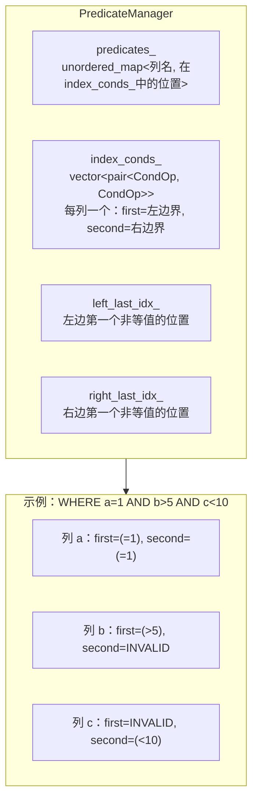
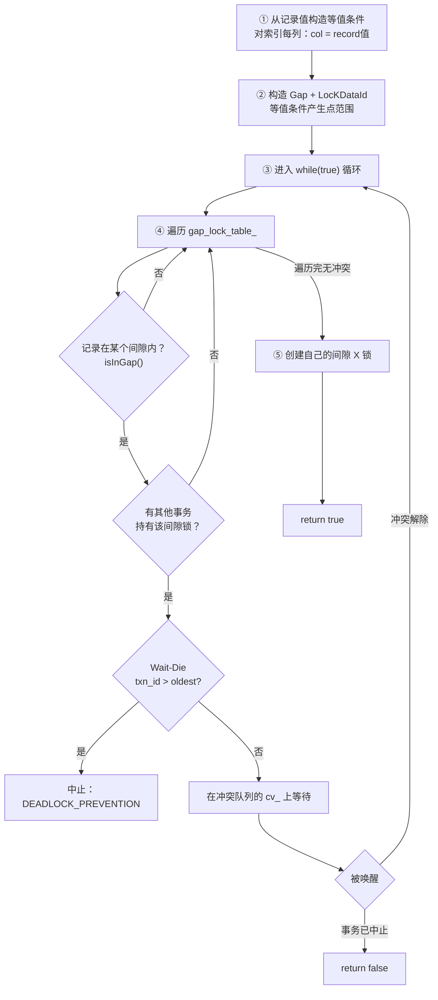

# 间隙锁深入：谓词管理、冲突检测与安全检查

## PredicateManager

**含义**：`PredicateManager` 是 WHERE 条件中索引列谓词的解析器，将零散的等值/范围条件整理成每列的左右边界对。

**作用**：它为 `Gap` 构造和 B+ 树范围扫描提供统一的边界数据——从一条 `WHERE a = 1 AND b > 5 AND c < 10` 中提取出 `[(=1, =1), (>5, INVALID), (INVALID, <10)]`。

**场景**：被 `isSafeInGap`（插入安全检查）、`IndexScanExecutor`（索引范围扫描边界构造）和 `lock_shared_on_gap` / `lock_exclusive_on_gap`（间隙锁范围定义）调用。

```cpp
// src/execution/predicate_manager.h:10-23
class PredicateManager {
 public:
  PredicateManager() = default;

  explicit PredicateManager(IndexMeta& index_meta) {
    predicates_.reserve(index_meta.col_num);
    index_conds_.reserve(index_meta.col_num);
    for (size_t i = 0; i < index_meta.cols.size(); ++i) {
      predicates_.emplace(index_meta.cols[i].second.name, i);
      index_conds_.emplace_back(index_meta.cols[i].first,
                                index_meta.cols[i].first);
    }
  }
```

**内部数据结构**：



**`addPredicate` 的分发逻辑**：

- `OP_GT` / `OP_GE` / `OP_EQ` → 放入**左边界**（first）
- `OP_LT` / `OP_LE` / `OP_EQ` → 放入**右边界**（second）
- `OP_EQ` 同时放入两边——等值条件既是左边界也是右边界

```cpp
// src/execution/predicate_manager.h:25-38
bool addPredicate(const std::string& column, Condition& cond) {
  if (predicates_.count(column) == 0) {
    return false;  // 非索引列，忽略
  }
  if (cond.op == OP_GT || cond.op == OP_GE || cond.op == OP_EQ) {
    insertLeft(column, cond);
  }
  if (cond.op == OP_LT || cond.op == OP_LE || cond.op == OP_EQ) {
    insertRight(column, cond);
  }
  return true;
}
```

**示例**：复合索引 `(a, b, c)`，WHERE 条件是 `a = 1 AND b > 5 AND c < 10`：

| 步骤 | 操作 | predicates_ | index_conds_ |
|------|------|-------------|--------------|
| 初始 | 构造 | `{"a":0, "b":1, "c":2}` | `[(INV, INV), (INV, INV), (INV, INV)]` |
| ① | addPredicate("a", `a=1`) | 不变 | `[(=1, =1), (INV, INV), (INV, INV)]` |
| ② | addPredicate("b", `b>5`) | 不变 | `[(=1, =1), (>5, INV), (INV, INV)]` |
| ③ | addPredicate("c", `c<10`) | 不变 | `[(=1, =1), (>5, INV), (INV, <10)]` |

`index_conds_` 最终就是 `Gap` 构造函数的输入。

**`getIndexConds()` 的返回值**：直接返回 `index_conds_`，供 `Gap` 构造函数使用。这个方法把 PredicateManager 的输出桥接到 LockManager 的间隙锁机制。

**输入**：`addPredicate` 输入列名和 `Condition` 对象。

**输出**：`getIndexConds()` 输出 `vector<pair<CondOp, CondOp>>`，可直接传给 `Gap`。

## Gap::isCoincide 完整算法

**含义**：`isCoincide` 判断两个 Gap 是否在索引空间中相交。

**作用**：间隙锁冲突检测的核心——如果两个间隙相交且锁类型冲突，后到的事务必须等待或中止。

**算法**：两次遍历，检查区间相交的两个方向。

```
区间 A 和 B 相交的充要条件：(A.min <= B.max) AND (B.min <= A.max)
```

第一次遍历：检查"当前 Gap 的左边界 vs 参数 Gap 的右边界"（`A.min <= B.max`）。

第二次遍历：检查"参数 Gap 的左边界 vs 当前 Gap 的右边界"（`B.min <= A.max`）。

两次都通过才算相交。

```cpp
// src/transaction/txn_defs.h:119-177
bool isCoincide(const Gap& gap) const {
  // === 第一遍：当前 Gap 的左边 vs 参数 Gap 的右边 ===
  for (std::size_t i = 0; i < index_conds_.size(); ++i) {
    auto& lhs_cond = index_conds_[i].first;       // 当前 Gap 的左条件
    auto& rhs_cond = gap.index_conds_[i].second;   // 参数 Gap 的右条件
    if (lhs_cond.op != OP_INVALID && rhs_cond.op != OP_INVALID) {
      auto& type = lhs_cond.rhs_val.type;
      auto& lhs_rec = lhs_cond.rhs_val.raw;
      auto& rhs_rec = rhs_cond.rhs_val.raw;
      int cmp = compare(lhs_rec->data, rhs_rec->data, lhs_rec->size, type);

      // 边界严格性判断
      if (cmp > 0 ||
          (cmp == 0 && (lhs_cond.op == OP_GT || rhs_cond.op == OP_LT))) {
        return false;  // A.min > B.max，不相交
      }
    }
  }

  // === 第二遍：参数 Gap 的左边 vs 当前 Gap 的右边 ===
  for (size_t i = 0; i < index_conds_.size(); ++i) {
    auto& lhs_cond = gap.index_conds_[i].first;     // 参数 Gap 的左条件
    auto& rhs_cond = index_conds_[i].second;         // 当前 Gap 的右条件
    // ... 相同的比较逻辑 ...
    if (cmp > 0 ||
        (cmp == 0 && (lhs_cond.op == OP_GT || rhs_cond.op == OP_LT))) {
      return false;  // B.min > A.max，不相交
    }
  }

  return true;  // 两遍都通过，相交
}
```

**边界严格性规则**：当两个边界值相等时，开区间和闭区间的区别决定是否相交。

| 左边界操作符 | 右边界操作符 | cmp==0 时结果 | 解释 |
|-------------|-------------|-------------|------|
| `>=` | `<=` | ✅ 相交 | `[5` 和 `5]` 在 5 处重合 |
| `>=` | `<` | ❌ 不相交 | `[5` 和 `5)` 在 5 处不重合，右边界不含 5 |
| `>` | `<=` | ❌ 不相交 | `(5` 和 `5]` 在 5 处不重合，左边界不含 5 |
| `>` | `<` | ❌ 不相交 | `(5` 和 `5)` 都不含 5 |
| `=` | `<=` | ✅ 相交 | `[5` 和 `5]` 等价 |
| `=` | `<` | ❌ 不相交 | `[5` 和 `5)` 不重合 |

源码中的判断逻辑：`cmp == 0 && (lhs_cond.op == OP_GT || rhs_cond.op == OP_LT)` 为真 → 不相交。即"等值时，只要有一边是严格开区间（`>` 或 `<`），就不相交"。

**示例**：

```
Gap A: age ∈ [18, 30)    →  left=(>=18), right=(<30)
Gap B: age ∈ (25, 40]    →  left=(>25), right=(<=40)

第一遍：A.left(>=18) vs B.right(<=40) → 18 <= 40 → 通过
第二遍：B.left(>25) vs A.right(<30) → 25 < 30 → 通过
结论：相交 ✅

Gap C: age ∈ [18, 20)    → left=(>=18), right=(<20)
Gap D: age ∈ [20, 30)    → left=(>=20), right=(<30)

第一遍：C.left(>=18) vs D.right(<30) → 18 < 30 → 通过
第二遍：D.left(>=20) vs C.right(<20) → cmp==0, C.right 是 OP_LT → 不相交 ❌
结论：不相交（C 的右边界是开区间，不含 20）
```

**为什么需要两次遍历**：复合索引（多列）时，每列的边界独立判断。第一遍和第二遍检查的是相交条件的两个方向——A 的左在 B 的右左边 **且** B 的左在 A 的右左边。两遍必须都通过。

## Gap::isInGap

**含义**：`isInGap` 判断一条记录是否落在当前 Gap 的范围内。

**作用**：`isSafeInGap` 用它筛选哪些已有间隙锁与待插入记录冲突——如果记录不在某个间隙中，该间隙的锁对它没有影响。

```cpp
// src/transaction/txn_defs.h:114-116
bool isInGap(const RmRecord& rec) const {
  return cmpIndexLeftConds(rec) && cmpIndexRightConds(rec);
}
```

内部逻辑：分别检查记录是否满足所有左边界条件（`>=`、`>`、`=`）和所有右边界条件（`<=`、`<`、`=`）。两边都满足才算在间隙内。

**示例**：Gap `age ∈ [18, 30)`，记录 `age = 25` → `25 >= 18` ✅ 且 `25 < 30` ✅ → 在间隙内。记录 `age = 30` → `30 >= 18` ✅ 但 `30 < 30` ❌ → 不在间隙内。

## isSafeInGap 完整走读

**含义**：`isSafeInGap` 检查一条即将插入的记录是否会与任何已存在的间隙锁冲突。

**作用**：InsertExecutor 在真正插入记录前调用它。如果返回 `true`，表示目标位置没有被其他事务的间隙锁覆盖，可以安全插入。

**场景**：InsertExecutor 在执行 `INSERT INTO student VALUES (...)` 时，对表上的每个索引调用 `isSafeInGap`。

```cpp
// src/transaction/concurrency/lock_manager.cpp:498-635
bool LockManager::isSafeInGap(Transaction* txn, IndexMeta& index_meta,
                              RmRecord& record, int tab_fd) {
  std::unique_lock lock(latch_);

  // === 第 1 步：构造 PredicateManager，从记录值生成等值条件 ===
  auto predicate_manager = PredicateManager(index_meta);
  std::vector<Condition> conds(index_meta.cols.size());
  int idx = 0;
  for (auto& [index_offset, col_meta] : index_meta.cols) {
    Value v;
    v.raw = std::make_shared<RmRecord>(record.data + col_meta.offset,
                                        col_meta.len);
    switch (col_meta.type) {
      case TYPE_INT:
        v.set_int(*reinterpret_cast<int*>(v.raw->data));
        break;
      case TYPE_FLOAT:
        v.set_float(*reinterpret_cast<float*>(v.raw->data));
        break;
      case TYPE_STRING:
        std::string s(v.raw->data, v.raw->size);
        v.set_str(s);
        break;
    }
    conds[idx].op = OP_EQ;
    conds[idx].lhs_col = {"", col_meta.name};
    conds[idx].rhs_val = std::move(v);
    ++idx;
  }
  for (auto& cond : conds) {
    predicate_manager.addPredicate(cond.lhs_col.col_name, cond);
  }

  // === 第 2 步：构造 Gap，LocKDataId ===
  auto gap = Gap(predicate_manager.getIndexConds());
  LockDataId lock_data_id(tab_fd, index_meta, gap, LockDataType::GAP);

  // === 第 3 步：循环检查 + 条件等待 ===
  while (true) {
    bool conflict_detected = false;

    auto outer_it = gap_lock_table_.find(index_meta);
    if (outer_it != gap_lock_table_.end()) {
      auto& inner_map = outer_it->second;

      for (auto& [data_id, queue] : inner_map) {
        // 跳过不相交的间隙
        if (!data_id.gap_.isInGap(record)) continue;

        // 检查是否有其他事务持有锁
        bool other_holder = false;
        for (auto& req : queue.request_queue_) {
          if (req.txn_id_ != txn->get_transaction_id() && req.granted_) {
            other_holder = true;
            break;
          }
        }
        if (!other_holder) continue;

        // Wait-die：年轻事务 → 中止
        if (txn->get_transaction_id() > queue.oldest_txn_id_) {
          throw TransactionAbortException(txn->get_transaction_id(),
                                          AbortReason::DEADLOCK_PREVENTION);
        }

        conflict_detected = true;
        // 条件等待：直到冲突解除或事务中止
        queue.cv_.wait(lock, [&] {
          if (txn->get_state() == TransactionState::ABORTED) return true;
          if (queue.request_queue_.empty()) return true;
          for (auto& req : queue.request_queue_) {
            if (req.txn_id_ != txn->get_transaction_id() && req.granted_)
              return false;
          }
          return true;
        });

        if (txn->get_state() == TransactionState::ABORTED) return false;
        break;
      }
    }

    if (conflict_detected) continue;  // 被唤醒后重新扫描

    // === 第 4 步：无冲突，创建自己的间隙 X 锁 ===
    auto& inner_map = gap_lock_table_[index_meta];

    if (auto it = inner_map.find(lock_data_id); it != inner_map.end()) {
      bool held_by_self = false;
      for (auto& req : it->second.request_queue_) {
        if (req.txn_id_ == txn->get_transaction_id() && req.granted_) {
          held_by_self = true;
          break;
        }
      }
      if (held_by_self) return true;
      conflict_detected = true;
      continue;
    }

    auto [it, inserted] = inner_map.emplace(
        std::piecewise_construct, std::forward_as_tuple(lock_data_id),
        std::forward_as_tuple());

    if (inserted) {
      LockRequestQueue& new_queue = it->second;
      new_queue.oldest_txn_id_ = txn->get_transaction_id();
      new_queue.request_queue_.emplace_back(txn->get_transaction_id(),
                                            LockMode::EXCLUSIVE, true);
      new_queue.group_lock_mode_ = GroupLockMode::X;
      txn->get_lock_set()->emplace(lock_data_id);
      return true;
    }

    conflict_detected = true;
  }
  return true;
}
```

**流程总览**：



**关键设计点**：

1. **`while(true)` 循环**：因为被 `cv_.wait()` 唤醒后其他事务可能又创建了新的间隙锁，所以必须重新扫描全部间隙。

2. **`isInGap` 而非 `isCoincide`**：`isSafeInGap` 检查的是一个**点**（待插入记录）是否落在已有间隙中，所以用 `isInGap`（点是否在区间内），而不是 `isCoincide`（两个区间是否相交）。

3. **条件等待的谓词**：等待的条件是"冲突队列中只有自己的请求或队列已空"，而不是"间隙锁被完全释放"。这允许并发插入不同位置。

4. **事务中止检测**：`cv_.wait` 被唤醒后检查 `txn->get_state() == TransactionState::ABORTED`，处理 wait-die 导致的中止。

**输入**：`txn` 是插入事务，`index_meta` 是目标索引元数据，`record` 是待插入记录，`tab_fd` 是表文件描述符。

**输出**：`true` 表示安全（已隐式获得该间隙的 X 锁），`false` 表示事务已中止。

**锁说明**：事务级间隙锁，范围是 `index_meta` 对应索引上 `record` 落入的间隙，类型 X（排他），生命周期从 `isSafeInGap` 创建到事务提交/回滚时 unlock。

## 间隙锁的 S→X 升级

**含义**：在 `lock_exclusive_on_gap` 中，如果事务已持有同一间隙的 S 锁，且是唯一持有者（`shared_lock_num_ == 1`），可以直接原位升级为 X 锁。

**作用**：避免先释放再重新申请的额外开销和时间窗口。

```cpp
// src/transaction/concurrency/lock_manager.cpp:280-299
// 在 lock_exclusive_on_gap 中，本事务已有 S 锁时的处理：
if (lock_request.lock_mode_ == LockMode::SHARED) {
  // 有间隙 S 锁，且队列中只有自己拿到 X 锁
  if (lock_request_queue.shared_lock_num_ == 1 && !contain) {
    lock_request.lock_mode_ = LockMode::EXCLUSIVE;
    lock_request_queue.shared_lock_num_ = 0;
    lock_request_queue.group_lock_mode_ = GroupLockMode::X;
    return true;
  }
  // 有多个持有者 → wait-die → cv_.wait
}
```

与表级/记录级锁升级的相同模式：只有当自己是唯一持有者时才能直接升级。

## unlock 中的跨队列间隙通知

**含义**：释放间隙锁时，不仅通知同队列的等待者，还要通知所有**间隙相交**的队列。

**作用**：因为间隙锁的冲突检查跨越不同队列（通过 `isCoincide`），释放时必须唤醒所有可能被阻塞的相交间隙上的等待者。

```cpp
// src/transaction/concurrency/lock_manager.cpp:1429-1436
if (lock_data_id.type_ == LockDataType::GAP) {
  // 相交的间隙锁也得唤醒
  for (auto& [data_id, queue] : ii->second) {
    if (lock_data_id.gap_.isCoincide(data_id.gap_)) {
      queue.cv_.notify_all();
    }
  }
  ii->second.erase(it);
}
```

同样在队列非空时（第 1461-1468 行）也会遍历相交间隙并通知：

```cpp
// src/transaction/concurrency/lock_manager.cpp:1461-1468
if (lock_data_id.type_ == LockDataType::GAP) {
  for (auto& [data_id, queue] : ii->second) {
    if (lock_data_id.gap_.isCoincide(data_id.gap_)) {
      queue.cv_.notify_all();
    }
  }
}
```

**为什么表锁和记录锁不需要这样**：表锁和记录锁的冲突检查局限在**同一 LockDataId 的队列内**，所以只需 `notify_all` 自己的 `cv_`。间隙锁需要跨队列检查 `isCoincide`，因此释放时也必须跨队列通知。

**示例**：T1 持有 Gap A `age ∈ [18, 30)` 的 X 锁，T2 持有 Gap B `age ∈ [25, 40)` 的 S 锁。当 T1 提交释放 Gap A 时，如果有 T3 正在等待 Gap B 的 X 锁（被 T1 的 Gap A 阻塞），T3 也被唤醒。因为 T2 的 S 锁本身不阻塞 X 锁，但 T1 的相交 X 锁阻塞了 T3。

上一节：[05-gap-lock.md](./05-gap-lock.md) | 下一节：[06-transaction-interaction.md](./06-transaction-interaction.md)
