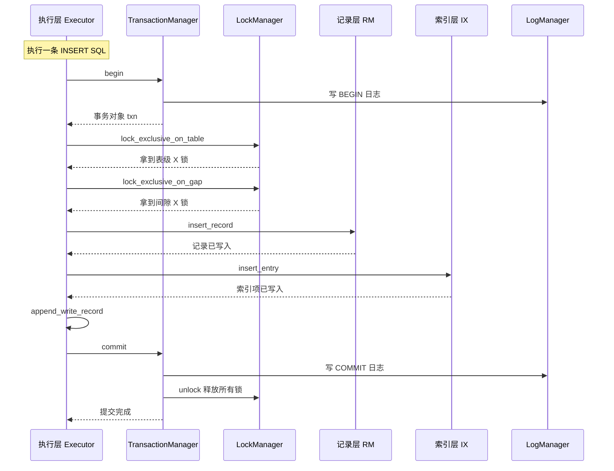
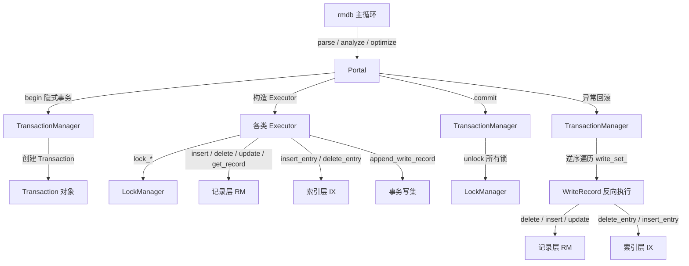

# 事务层组件交互

## 交互总览

**含义**：事务层是执行层、记录层、索引层的中间协调者。

**作用**：它不直接读写记录与索引，但每一笔读写都要经过事务层的锁检查和写集记录。



## 锁申请在什么位置发生

**含义**：不是所有记录访问都在记录层加锁——锁申请发生在上层的执行器和系统管理器中。

**作用**：把锁逻辑放在执行层入口，记录层就不需要知道事务对象的存在，保持各层职责清晰。

**场景**：每条 SQL 语句的执行都会触发对应的锁申请路径。

| 算子 | 加锁方法 | 锁类型 | 锁资源 |
|------|---------|--------|--------|
| SeqScanExecutor | `lock_shared_on_table` | S | 整张表 |
| IndexScanExecutor | `lock_shared_on_gap` 或 `lock_exclusive_on_gap` | S 或 X | 扫描的索引范围 |
| InsertExecutor | `lock_exclusive_on_table` 和 `lock_exclusive_on_gap` | X | 表和索引间隙 |
| DeleteExecutor | `lock_exclusive_on_table` 和 `lock_exclusive_on_gap` | X | 表和索引间隙 |
| UpdateExecutor | `lock_exclusive_on_table` 和 `lock_exclusive_on_gap` | X | 表和索引间隙 |
| SmManager 读表 | `lock_shared_on_table` | S | 整张表 |

**锁说明**：以上说的都是事务级锁。

**范围**：执行层申请的锁范围从整张表到索引间隙再到单条记录。

**类型**：读路径使用 S 锁，写路径使用 X 锁，间隙锁始终跟随索引。

**生命周期**：在算子初始化或扫描前申请，事务结束时由 TransactionManager 统一释放。

## 写集记录在什么时候发生

**含义**：写集记录发生在物理数据已经改变之后、事务提交之前。

**作用**：它给回滚提供完整的恢复信息——只要知道写过什么，就能反向撤销。

**场景**：InsertExecutor、DeleteExecutor、UpdateExecutor 在执行真实修改后调用 `append_write_record`。

```cpp
// src/execution/executor_insert.h:161
context_->txn_->append_write_record(write_record);
```

```cpp
// src/execution/executor_delete.h:89
context_->txn_->append_write_record(write_record);
```

```cpp
// src/execution/executor_update.h:162
context_->txn_->append_write_record(write_record);
```

**示例**：UPDATE 把 age 从 18 改成 19 时，先调用 `fh->update_record` 完成物理修改，再把 WriteRecord 追加到事务的 `write_set_` 中。

## 事务生命周期与层间调用流

**含义**：一个事务从 begin 到 commit 或 abort 的完整路径会经过多个模块。



## 异常回滚流程

**含义**：当事务执行过程中抛出 `TransactionAbortException` 时，顶层 `rmdb.cpp` 会捕获异常并调用 `TransactionManager::abort`。

```cpp
// src/rmdb.cpp:271
txn_manager->abort(context->txn_, log_manager.get());
```

**示例**：T1 执行 `DELETE WHERE age > 20` 时，扫描器对每个被扫到的记录调用 `lock_exclusive_on_record`，如果某次加锁与老事务冲突，跳出的 `DEADLOCK_PREVENTION` 异常被 rmdb 捕获并触发 abort。

## 记录层的锁注释

**含义**：参考实现 `src/record/rm_file_handle.cpp` 中的锁调用被注释掉了，提供为可切换的实现方案。

**作用**：框架实现者可以把锁放在执行层入口，也可以在记录层内部关闭锁逻辑。

```cpp
// src/record/rm_file_handle.cpp:26
// context->lock_mgr_->lock_shared_on_record(context->txn_, rid, fd_);
```

**结论**：当前参考方案把记录级锁的实际调用留在了注释中，框架实现的同学可以自由选择在哪一层加锁。

## 日志记录

**含义**：事务的每个状态变化都会写日志。

**作用**：它让恢复层可以重放或撤销事务。详细格式和数据结构见第 7 章。

**场景**：begin、commit、abort 以及回滚过程中的每条 INSERT、DELETE、UPDATE 反向操作都会写日志。

| 事务阶段 | 日志类型 | 记录内容 |
|---------|---------|---------|
| begin | BeginLogRecord | txn_id |
| commit | CommitLogRecord | txn_id、prev_lsn |
| abort 反向操作 | InsertLogRecord 或 DeleteLogRecord 或 UpdateLogRecord | txn_id、记录内容、Rid、表名 |
| abort 结束 | AbortLogRecord | txn_id、prev_lsn |

上一节：[05b-gap-lock-detail.md](./05b-gap-lock-detail.md) | 下一节：[07-transaction-frame-vs-reference.md](./07-transaction-frame-vs-reference.md)
