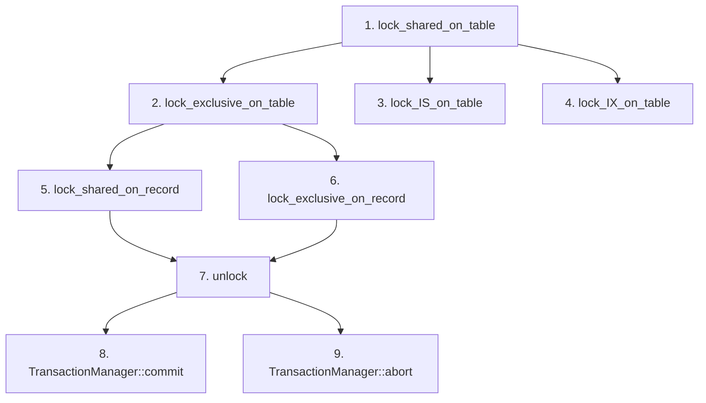

# 框架与参考实现对比

## 本篇目的

**含义**：本文把 `db2026-x/src/transaction/` 中的待实现内容与 `src/transaction/` 的参考实现逐项对应起来。

**作用**：帮助框架实现者快速定位“要写什么”和“怎么写”。

**用法**：按序号顺序实现，每完成一项后编译验证。

## 1. TransactionManager::commit

**位置**：`db2026-x/src/transaction/transaction_manager.cpp:50-58`

**框架现状**：方法体为空，只有 TODO 注释。

**要做什么**：实现事务的提交流程。

**参考实现**：`src/transaction/transaction_manager.cpp:55-84`

**核心步骤**：

- 遍历 `write_set_` 释放写集指针
- 遍历 `lock_set_` 调用 `lock_manager_->unlock`
- 清空锁集合
- 写 COMMIT 日志
- 设置事务状态为 `COMMITTED`

**依赖**：LockManager::unlock 必须先实现。

## 2. TransactionManager::abort

**位置**：`db2026-x/src/transaction/transaction_manager.cpp:66-74`

**框架现状**：方法体为空，只有 TODO 注释。

**要做什么**：实现事务的回滚流程。

**参考实现**：`src/transaction/transaction_manager.cpp:91-222`

**核心步骤**：

- 逆序遍历 `write_set_`
- 对 INSERT 记录执行 `delete_record` 并删除索引项
- 对 DELETE 记录执行 `insert_record` 并重新插入索引项
- 对 UPDATE 记录执行 `update_record` 恢复旧值，处理索引更新
- 遍历 `lock_set_` 释放所有锁
- 清空锁集合
- 写 ABORT 日志
- 设置事务状态为 `ABORTED`

**难点**：索引回滚时需要从索引元数据和记录中提取 key 并拼接，然后调用 `delete_entry` 或 `insert_entry`。

## 3. LockManager::lock_shared_on_record

**位置**：`db2026-x/src/transaction/concurrency/lock_manager.cpp:19-22`

**框架现状**：直接返回 `true`，没有实际加锁。

**要做什么**：实现记录级共享锁。

**参考实现**：`src/transaction/concurrency/lock_manager.cpp:644-736`

**核心步骤**：

- 用 `latch_` 保护锁表
- 调用 `check_lock` 检查 2PL 阶段
- 构造 `LockDataId(tab_fd, rid, LockDataType::RECORD)`
- 在 `lock_table_` 中查找或创建请求队列
- 如果该事务已有锁则可直接返回
- 如果有 X、IX 或 SIX 冲突锁，应用 wait-die 逻辑或等待
- 否则在请求队列中添加 SHARED 请求
- 更新队列锁模式为 S

**依赖**：LockRequestQueue、LockRequest 和 check_lock 需正确初始化和实现。

## 4. LockManager::lock_exclusive_on_record

**位置**：`db2026-x/src/transaction/concurrency/lock_manager.cpp:31-34`

**框架现状**：直接返回 `true`，没有实际加锁。

**要做什么**：实现记录级排他锁。

**参考实现**：`src/transaction/concurrency/lock_manager.cpp:745-869`

**核心步骤**：

- 与共享锁流程一致，但锁类型为 EXCLUSIVE
- 如果事务已有共享锁且只有自己持有，可升级为排他锁
- 更新队列锁模式为 X

**注意**：升级锁是排他锁实现的难点——需要处理自己已有 S 锁改为 X 锁的情况。

## 5. LockManager::lock_shared_on_table

**位置**：`db2026-x/src/transaction/concurrency/lock_manager.cpp:42-45`

**框架现状**：直接返回 `true`。

**要做什么**：实现表级共享锁。

**参考实现**：`src/transaction/concurrency/lock_manager.cpp:877-972`

## 6. LockManager::lock_exclusive_on_table

**位置**：`db2026-x/src/transaction/concurrency/lock_manager.cpp:53-56`

**框架现状**：直接返回 `true`。

**要做什么**：实现表级排他锁。

**参考实现**：`src/transaction/concurrency/lock_manager.cpp:980-1107`

## 7. LockManager::lock_IS_on_table

**位置**：`db2026-x/src/transaction/concurrency/lock_manager.cpp:64-67`

**框架现状**：直接返回 `true`。

**要做什么**：实现表级意向共享锁。

**参考实现**：`src/transaction/concurrency/lock_manager.cpp:1115-1197`

**特点**：IS 锁与 X 锁冲突，与 IX、S、SIX 都兼容。

## 8. LockManager::lock_IX_on_table

**位置**：`db2026-x/src/transaction/concurrency/lock_manager.cpp:75-78`

**框架现状**：直接返回 `true`。

**要做什么**：实现表级意向排他锁。

**参考实现**：`src/transaction/concurrency/lock_manager.cpp:1205-1345`

**特点**：IX 锁与 S、SIX 冲突，与 IS、IX 兼容。

## 9. LockManager::unlock

**位置**：`db2026-x/src/transaction/concurrency/lock_manager.cpp:86-89`

**框架现状**：直接返回 `true`。

**要做什么**：实现锁释放。

**参考实现**：`src/transaction/concurrency/lock_manager.cpp:1353-1470`

**核心步骤**：

- 如果事务已结束则返回 `false`
- 如果事务在 GROWING 阶段则切换到 SHRINKING
- 在 `lock_table_` 或 `gap_lock_table_` 中找到对应队列
- 删除该事务的所有请求
- 如果队列为空则删除队列并唤醒等待者
- 否则重算队列锁模式和最老事务编号并唤醒等待者

## 未在框架中出现的参考实现

**含义**：以下功能在参考实现中有完整实现，但框架中没有对应的空方法和数据目录。

**作用**：这些功能的缺失不影响通过基础题目，但在实现更高阶的可串行化测试时需要自行添加。

- `lock_shared_on_gap` / `lock_exclusive_on_gap`：间隙锁
- `isSafeInGap`：插入安全检查
- `Gap`：索引范围定义
- `gap_lock_table_`：间隙锁表
- `upgrading_` 标志位：在头文件中声明但源码中从未使用，属于早期版本的遗留代码，不需实现

**建议**：先把上面 9 项做完并通过基础并发测试，再考虑补充间隙锁逻辑。

## 实现顺序建议

**理由**：表级锁最简单，先做表级锁可以跑通基本流程；记录级锁依赖表级锁的 wait-die 逻辑；unlock 是所有结束路径的基础；commit 和 abort 依赖 unlock。

上一节：[06-transaction-interaction.md](./06-transaction-interaction.md) | 下一节：[08-transaction-api-reference.md](./08-transaction-api-reference.md)
