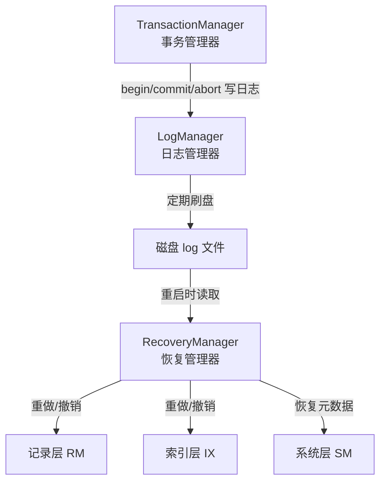
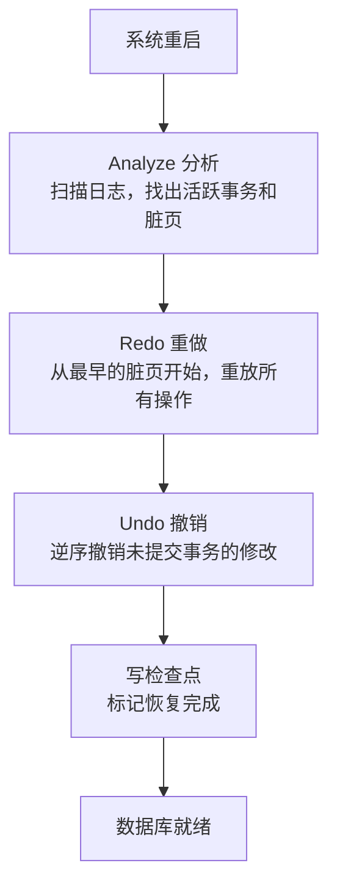

# 故障恢复概述

## 故障恢复在架构中的位置



**含义**：故障恢复是 DBMS 的"保险"——在系统崩溃后，通过日志把数据恢复到一致状态。

**作用**：保证 ACID 中的 D（持久性）——已提交的事务即使系统崩溃也不丢失。同时保证 A（原子性）在崩溃场景下——未完成的事务全部回滚。

**源码**：`src/recovery/`

```
src/recovery/
├── log_defs.h         # 日志记录类型定义
├── log_manager.h      # 日志管理器（写日志、刷盘）
├── log_manager.cpp
├── log_recovery.h     # 恢复管理器（崩溃恢复算法）
└── log_recovery.cpp
```

## 核心概念：WAL

**含义**：WAL（Write-Ahead Logging，预写日志）是数据库恢复的基础协议。

**规则**：在对数据页面做任何修改之前，必须先把对应的日志记录刷到磁盘。

```
修改操作:
  1. 写日志到 log_buffer（内存）
  2. 写数据到 page（内存）
  3. 提交时：先刷日志到磁盘，再刷数据到磁盘

崩溃恢复:
  1. 读取磁盘上的日志文件
  2. 重做（Redo）已提交事务的修改
  3. 撤销（Undo）未提交事务的修改
```

**为什么必须先刷日志**：如果先写数据页，在日志写之前崩溃了——日志里没有这个操作的记录——恢复时无法知道这个操作有没有做，数据可能不一致。

## 日志系统

### 日志类型

**源码**：`src/recovery/log_manager.h:23-31`

```cpp
// src/recovery/log_manager.h:23
enum LogType : int {
  UPDATE = 0,
  INSERT,
  DELETE,
  BEGIN,
  COMMIT,
  ABORT,
  STATIC_CHECKPOINT
};
```

| 日志类型 | 含义 | 记录内容 |
|---------|------|---------|
| BEGIN | 事务开始 | 事务 ID |
| COMMIT | 事务提交 | 事务 ID |
| ABORT | 事务回滚 | 事务 ID |
| INSERT | 插入记录 | 事务 ID + 表名 + Rid + 插入的记录 |
| DELETE | 删除记录 | 事务 ID + 表名 + Rid + 被删除的记录 |
| UPDATE | 更新记录 | 事务 ID + 表名 + Rid + 旧值 + 新值 |
| STATIC_CHECKPOINT | 检查点 | 标记恢复起点 |

### 日志记录的结构

**源码**：`src/recovery/log_manager.h:37-76`，`src/recovery/log_defs.h:20-35`

每条日志记录由一个固定长度的**日志头**和变长的**日志体**组成：

```
┌───────────────────────────────────────────────────────────────────┐
│ 日志头(LOG_HEADER_SIZE)                                            │
│ ┌────────────┬──────────┬──────────────┬──────────┬─────────────┐ │
│ │ log_type_  │  lsn_    │ log_tot_len_ │ log_tid_ │ prev_lsn_   │ │
│ │ (int)      │ (lsn_t)  │ (uint32_t)   │ (txn_id) │ (lsn_t)     │ │
│ └────────────┴──────────┴──────────────┴──────────┴─────────────┘ │
├───────────────────────────────────────────────────────────────────┤
│ 日志体(变长)                                                        │
│ INSERT: record_size + record_data + rid + table_name              │
│ DELETE: record_size + record_data + rid + table_name              │
│ UPDATE: old_size + old_data + new_data + rid + name               │
│ BEGIN/COMMIT/ABORT: （无日志体）                                    │
└───────────────────────────────────────────────────────────────────┘
```

**含义**：
- `lsn_`（Log Sequence Number）：全局递增的日志序列号，唯一标识每条日志。
- `prev_lsn_`：同一事务的前一条日志的 LSN。通过它，可以沿着链表回溯事务的所有操作——这就是 UNDO 的基础。
- `log_tid_`：产生这条日志的事务 ID。

**为什么有 `lsn_` 了还需要 `prev_lsn_`**？因为多个并发事务的日志是**交错写入**的——同一个事务的日志不连续。

假设 T1 和 T2 同时执行，日志缓冲区里实际是这样：

```
LSN:   1       2        3       4        5        6        7        8
     BEGIN   BEGIN   UPDATE   UPDATE   INSERT   DELETE   COMMIT   UPDATE
      T1      T2      T1(X)    T2(Y)    T1(Z)    T2(Y)     T2      T1(X)
            └──────────────────────────────────────────────────┘
                         T2 的日志散落在 2、4、6、7
     └──────────────────────────────────────────────────────────────────┘
                            T1 的日志散落在 1、3、5、8
```

如果只用 `lsn_` + `log_tid_` 来撤销 T1：

> 从 LSN 8 开始往回扫描全部 8 条日志，跳过 T2 的 4 条（LSN 7/6/4/2），挑出 T1 的 3 条（LSN 5/3/1）。每次都要读磁盘、解析日志头、判断 `log_tid_`。

有了 `prev_lsn_` 后，T1 的日志内部链：`8 → 5 → 3 → 1`。从 T1 最后一条日志（LSN 8）开始，顺着 `prev_lsn_` 跳 3 步就到头了——**一步都不碰 T2 的日志**。

| | 用 `lsn_` 扫描 | 用 `prev_lsn_` 链 |
|---|---|---|
| 遍历范围 | 全部日志（O(总日志数)） | 仅本事务（O(本事务日志数)） |
| 需要判断 | 每条检查 `log_tid_` 是否匹配 | 不检查，链上全是本事务 |
| 磁盘 I/O | 读取大量无关日志 | 只读本事务的日志 |

在磁盘上的日志文件可能有几十 MB 甚至更大，而这个扫描发生在**崩溃恢复**时——每多读一条无关日志就多一次磁盘 I/O。`prev_lsn_` 把这个开销从"扫描全部"降到了"只读相关"。

**类比**：`lsn_` 是书的页码，`prev_lsn_` 是同一角色每次出场的"见第 X 页"脚注。你要回顾某个角色的全部出场，有脚注就翻 3 页，没脚注就得从头翻到尾。

### LogManager：日志管理器

**源码**：`src/recovery/log_manager.h:437-490`

**含义**：LogManager 负责把日志写入日志缓冲区，并定期把缓冲区刷到磁盘。

关键成员和方法：

| 成员/方法 | 作用 |
|----------|------|
| `add_log_to_buffer(log_record)` | 把日志记录序列化写入 log_buffer_ |
| `flush_log_to_disk()` | 把 log_buffer_ 写入磁盘 |
| `background_flush()` | 后台线程，每秒自动调用 flush_log_to_disk() |
| `log_buffer_` | 日志缓冲区（内存） |
| `global_lsn_` | 全局 LSN 计数器，为每条日志分配 LSN |
| `persist_lsn_` | 已经持久化到磁盘的最后一条日志的 LSN |

**场景**：被 TransactionManager 在 begin/commit/abort 时调用，被执行器在 insert/delete/update 时调用。

## 崩溃恢复：三步算法

**源码**：`src/recovery/log_recovery.h:28-63`

**含义**：RecoveryManager 实现了类似 ARIES 的恢复算法，分三个阶段。

### 阶段 1：Analyze（分析）

**作用**：扫描日志文件，找出崩溃时的状态——哪些事务已提交、哪些事务未完成。

**输入**：磁盘上的日志文件。
**输出**：
- `active_txn_`：崩溃时活跃（未完成）的事务及其最后一条日志的 LSN
- `dirty_page_table_`：需要重做的页面的 LSN 列表
- `lsn_mapping_`：每条日志在文件中的位置，供后续查找

### 阶段 2：Redo（重做）

**作用**：把已提交事务的修改重放一遍，确保它们的数据页是最新的。

**原理**：从 dirty_page_table 中最早的一条日志开始，逐条执行日志对应的操作。不管事务是否提交——先全部重做。因为崩溃时可能有些已提交的事务还没来得及把数据页刷到磁盘。

### 阶段 3：Undo（撤销）

**作用**：把未提交事务的修改全部撤销，确保数据库只有已提交事务的修改。

**原理**：从每个活跃事务的最后一条日志开始，沿着 `prev_lsn_` 链表逆向遍历，逐条执行反向操作——INSERT 变 DELETE、DELETE 变 INSERT、UPDATE 恢复旧值。

### 恢复总流程



## 和前面几层的联系

| 前面学的层 | 被恢复层怎么用 |
|-----------|--------------|
| 事务层（Transaction） | RecoveryManager 持有 TransactionManager 指针，恢复时重建事务状态 |
| 系统层（SM） | RecoveryManager 持有 SmManager 指针，恢复元数据信息 |
| 缓冲池（BufferPool） | RecoveryManager 通过 BufferPoolManager 读写页面进行重做和撤销 |
| 存储层（Storage） | LogManager 通过 DiskManager 读写日志文件 |

上一节：[09-transaction-summary.md](../06-transaction-concurrency/09-transaction-summary.md) | 下一节：[02-recovery-data-structures.md](./02-recovery-data-structures.md)
