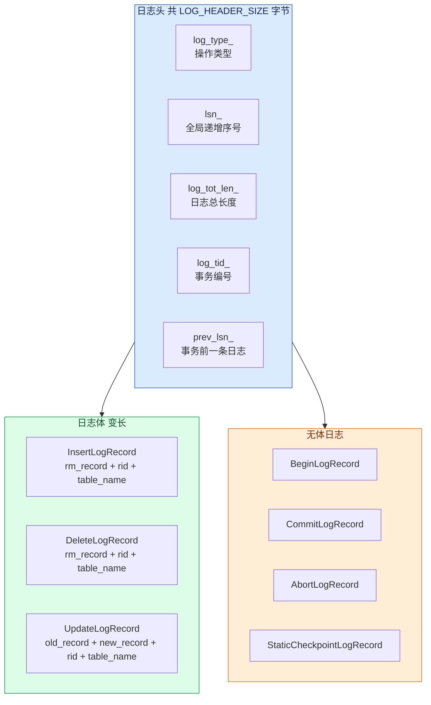

# 日志数据结构

## 数据结构总览

**含义**：恢复层的所有数据结构都围绕"日志"展开——基类定义通用接口，派生类携带各自的操作数据。



## LogRecord

**含义**：`LogRecord` 是所有日志记录的抽象基类。

**作用**：它定义了日志头的序列化和反序列化，所有具体的日志类型都继承它并添加自己的日志体数据。

```cpp
// src/recovery/log_manager.h:36-75
class LogRecord {
 public:
  LogType log_type_;
  lsn_t lsn_;
  uint32_t log_tot_len_;
  txn_id_t log_tid_;
  lsn_t prev_lsn_;

  virtual void serialize(char* dest) const {
    memcpy(dest + OFFSET_LOG_TYPE, &log_type_, sizeof(LogType));
    memcpy(dest + OFFSET_LSN, &lsn_, sizeof(lsn_t));
    memcpy(dest + OFFSET_LOG_TOT_LEN, &log_tot_len_, sizeof(uint32_t));
    memcpy(dest + OFFSET_LOG_TID, &log_tid_, sizeof(txn_id_t));
    memcpy(dest + OFFSET_PREV_LSN, &prev_lsn_, sizeof(lsn_t));
  }

  virtual void deserialize(const char* src) {
    log_type_ = *reinterpret_cast<const LogType*>(src);
    lsn_ = *reinterpret_cast<const lsn_t*>(src + OFFSET_LSN);
    log_tot_len_ = *reinterpret_cast<const uint32_t*>(src + OFFSET_LOG_TOT_LEN);
    log_tid_ = *reinterpret_cast<const txn_id_t*>(src + OFFSET_LOG_TID);
    prev_lsn_ = *reinterpret_cast<const lsn_t*>(src + OFFSET_PREV_LSN);
  }
```

**含义**：每个字段的作用如下。

| 字段 | 类型 | 含义 |
|------|------|------|
| `log_type_` | `LogType` | 操作类型，决定日志体如何解析 |
| `lsn_` | `lsn_t` | 日志序列号，全局递增且唯一 |
| `log_tot_len_` | `uint32_t` | 整条日志的字节数，头加体 |
| `log_tid_` | `txn_id_t` | 产生这条日志的事务编号 |
| `prev_lsn_` | `lsn_t` | 同一事务上一条日志的 LSN，形成事务内日志链 |

**示例**：事务 T3 先 UPDATE 再 INSERT，后一条 INSERT 日志的 `prev_lsn_` 指向前一条 UPDATE 日志的 `lsn_`，恢复时可以沿着链回溯 T3 的全部操作。

## 日志头内存布局

**含义**：每条日志在内存的前 LOG_HEADER_SIZE 字节是固定格式的日志头。

```cpp
// src/recovery/log_defs.h:22-34
static constexpr int OFFSET_LOG_TYPE = 0;
static constexpr int OFFSET_LSN = sizeof(int);
static constexpr int OFFSET_LOG_TOT_LEN = OFFSET_LSN + sizeof(lsn_t);
static constexpr int OFFSET_LOG_TID = OFFSET_LOG_TOT_LEN + sizeof(uint32_t);
static constexpr int OFFSET_PREV_LSN = OFFSET_LOG_TID + sizeof(txn_id_t);
static constexpr int OFFSET_LOG_DATA = OFFSET_PREV_LSN + sizeof(lsn_t);
static constexpr int LOG_HEADER_SIZE = OFFSET_LOG_DATA;
```

**含义**：日志头共 20 字节 = 4 字节 LogType + 4 字节 lsn + 4 字节 tot_len + 4 字节 txn_id + 4 字节 prev_lsn。

**作用**：固定布局让恢复时可离线解析任一位置的日志，不需要逐条类型判断就能提取关键字段。

**示例**：恢复管理器从磁盘读入一块日志后，直接按固定偏移读取每条日志的 `log_tot_len_` 来判断本条日志是否完整读入。

## LogType 枚举

**含义**：`LogType` 枚举标识每条日志对应的数据库操作。

```cpp
// src/recovery/log_manager.h:21-30
enum LogType : int {
  UPDATE = 0,
  INSERT,
  DELETE,
  BEGIN,
  COMMIT,
  ABORT,
  STATIC_CHECKPOINT
};
```

| 枚举值 | 含义 | 日志体内容 | 日志体长度 |
|--------|------|-----------|-----------|
| BEGIN | 事务开始 | 无 | 仅 LOG_HEADER_SIZE |
| COMMIT | 事务提交 | 无 | 仅 LOG_HEADER_SIZE |
| ABORT | 事务回滚 | 无 | 仅 LOG_HEADER_SIZE |
| INSERT | 插入记录 | 记录数据 + Rid + 表名 | 变长 |
| DELETE | 删除记录 | 记录数据 + Rid + 表名 | 变长 |
| UPDATE | 更新记录 | 旧记录 + 新记录 + Rid + 表名 | 变长 |
| STATIC_CHECKPOINT | 静态检查点 | 无 | 仅 LOG_HEADER_SIZE |

## InsertLogRecord

**含义**：INSERT 操作的日志记录。

**作用**：它保存插入的完整记录、插入位置和表名，供 redo 时重做插入、undo 时撤销删除。

```cpp
// src/recovery/log_manager.h:181-253
class InsertLogRecord : public LogRecord {
 public:
  InsertLogRecord(txn_id_t txn_id, RmRecord& insert_value, Rid& rid,
                  const std::string& table_name)
      : InsertLogRecord() {
    log_tid_ = txn_id;
    insert_value_ = insert_value;
    rid_ = rid;
    log_tot_len_ += sizeof(int) + insert_value_.size + sizeof(Rid);
    table_name_size_ = table_name.length();
    table_name_ = new char[table_name_size_ + 1];
    memcpy(table_name_, table_name.c_str(), table_name_size_);
    table_name_[table_name_size_] = '\0';
    log_tot_len_ += sizeof(size_t) + table_name_size_;
  }

  RmRecord insert_value_;
  Rid rid_;
  char* table_name_;
  size_t table_name_size_;
};
```

**示例**：执行 `INSERT INTO student VALUES (1, 'Alice', 20)` 后，日志体保存 student 表的这条完整记录、它被放的 Rid 和表名。

## DeleteLogRecord

**含义**：DELETE 操作的日志记录。

**作用**：它保存被删除的那条记录的原值和位置，供 redo 时重新删除、undo 时重新插入。

```cpp
// src/recovery/log_manager.h:258-330
class DeleteLogRecord : public LogRecord {
 public:
  DeleteLogRecord(txn_id_t txn_id, RmRecord& delete_value, Rid& rid,
                  const std::string& table_name)
      : DeleteLogRecord() {
    log_tid_ = txn_id;
    delete_value_ = delete_value;
    rid_ = rid;
    log_tot_len_ += sizeof(int) + delete_value_.size + sizeof(Rid);
    table_name_size_ = table_name.length();
    table_name_ = new char[table_name_size_ + 1];
    memcpy(table_name_, table_name.c_str(), table_name_size_);
    table_name_[table_name_size_] = '\0';
    log_tot_len_ += sizeof(size_t) + table_name_size_;
  }

  RmRecord delete_value_;
  Rid rid_;
  char* table_name_;
  size_t table_name_size_;
};
```

**示例**：执行 `DELETE FROM student WHERE id = 1` 后，DeleteLogRecord 保存 id=1 这条记录的完整内容和所在 Rid。

## UpdateLogRecord

**含义**：UPDATE 操作的日志记录。

**作用**：它同时保存旧值和新值，redo 时写入新值，undo 时恢复旧值。

```cpp
// src/recovery/log_manager.h:335-416
class UpdateLogRecord : public LogRecord {
 public:
  UpdateLogRecord(txn_id_t txn_id, RmRecord& old_value, RmRecord& update_value,
                  Rid& rid, const std::string& table_name)
      : UpdateLogRecord() {
    log_tid_ = txn_id;
    old_value_ = old_value;
    update_value_ = update_value;
    rid_ = rid;
    log_tot_len_ += sizeof(int) + old_value_.size + update_value_.size;
    log_tot_len_ += sizeof(Rid);
    table_name_size_ = table_name.length();
    table_name_ = new char[table_name_size_ + 1];
    memcpy(table_name_, table_name.c_str(), table_name_size_);
    table_name_[table_name_size_] = '\0';
    log_tot_len_ += sizeof(size_t) + table_name_size_;
  }

  RmRecord old_value_;
  RmRecord update_value_;
  Rid rid_;
  char* table_name_;
  size_t table_name_size_;
};
```

**示例**：`UPDATE student SET age = 19 WHERE id = 1` 产生一条 UpdateLogRecord，`old_value_` 保存 age=18 的旧记录，`update_value_` 保存 age=19 的新记录。

## LogBuffer

**含义**：`LogBuffer` 是日志写入磁盘前在内存中的暂存区。

**作用**：它合并多次小的日志写入为一次大的磁盘写入，减少磁盘 I/O 次数。

```cpp
// src/recovery/log_manager.h:419-433
class LogBuffer {
 public:
  LogBuffer() {
    offset_ = 0;
    memset(buffer_, 0, sizeof(buffer_));
  }

  bool is_full(uint32_t append_size) const {
    if (offset_ + append_size > LOG_BUFFER_SIZE) return true;
    return false;
  }

  char buffer_[LOG_BUFFER_SIZE + 1];
  uint32_t offset_;
};
```

**示例**：事务不断产生 INSERT、UPDATE 日志，每次调用 `add_log_to_buffer` 都把日志追加到 `buffer_` 中，直到 `is_full` 返回 true 或定期 `flush_log_to_disk` 时一次性写入磁盘。

上一节：[01-recovery-overview.md](./01-recovery-overview.md) | 下一节：[03-log-manager.md](./03-log-manager.md)
