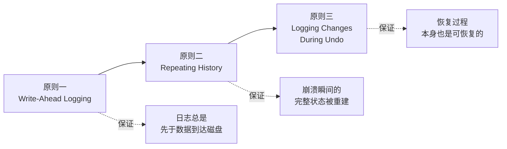

# ARIES 恢复算法三原则

## 为什么需要这个框架

**含义**：ARIES（Algorithm for Recovery and Isolation Exploiting Semantics）是数据库恢复领域的经典算法，由 IBM 研究院的 C. Mohan 等人在 1992 年提出。

**作用**：RMDB 的 RecoveryManager 实现了 ARIES 的简化版。理解三条原则后，`log_recovery.cpp` 中 analyze → redo → undo 的三段代码不再是孤立的步骤，而是一个有理论支撑的完整框架。

**场景**：这三条原则直接对应 RMDB 恢复代码的三个核心设计决策。

## 原则一：Write-Ahead Logging（先写日志）

**含义**：在对数据页面做任何修改之前，必须先把对应的日志记录持久化到磁盘。

**代码体现**：缓冲池中所有 `#ifdef ENABLE_LOGGING` 条件编译块。

```
修改记录的完整路径：
  1. 执行器修改 page 中的数据
  2. 创建日志记录（InsertLogRecord / DeleteLogRecord / UpdateLogRecord）
  3. add_log_to_buffer() → 日志进入内存缓冲区
  4. 如果缓冲区满 → flush_log_to_disk() → 日志持久化
  5. 修改后的 page 标记为 dirty
  6. 将来某个时刻 flush_page() 写回 page
      └─ 写回前检查：page_lsn > persist_lsn？
         ├─ 是 → flush_log_to_disk()（先刷日志）→ write_page()
         └─ 否 → write_page()（日志已在磁盘，直接刷页）
```

**为什么这个顺序关键**：考虑步骤 6 中 page 比 log 先到达磁盘的情况。崩溃后，磁盘上的 page 是新的（修改已落盘），但日志里没有对应的记录。恢复时无法知道这个修改是已提交还是未提交，数据进入不一致状态。

**LSN 的排序角色**：每条日志记录有唯一的、单调递增的 LSN（Log Sequence Number）。每个 page 保存着最后修改它的日志记录的 LSN（`page_lsn`）。比较 `page_lsn > persist_lsn` 就能判断"这个 page 的修改日志是否已经安全"——不需要检查日志文件内容。

## 原则二：Repeating History（重演历史）

**含义**：恢复时，把崩溃前做过的所有操作（无论事务最终是提交还是回滚）都重做一遍，把数据库恢复到崩溃瞬间的状态。

**代码体现**：`RecoveryManager::redo()` 遍历脏页表（DPT），对每个 LSN 重放日志记录。

```
崩溃前的操作序列：
  T1: BEGIN → INSERT R1 → UPDATE R2 → COMMIT
  T2: BEGIN → DELETE R3 → （崩溃！T2 未提交）

ARIES Redo 的做法：
  ✅ 重做 INSERT R1（T1 已提交）
  ✅ 重做 UPDATE R2（T1 已提交）
  ✅ 重做 DELETE R3（T2 未提交，但也重做！）
  
Redo 后磁盘状态 = 崩溃瞬间的内存状态（三个操作全部生效）
然后 Undo 会撤销 T2 的 DELETE R3
```

**为什么连未提交事务的操作也要重做**：简化恢复逻辑。如果不这样做，恢复时必须区分"已提交事务的操作"和"未提交事务的操作"，判断逻辑会非常复杂。先一股脑全部重做，再撤销未提交的——用两趟简单的遍历替代一趟复杂的判断。

**RMDB 的 DPT 构建方式**：标准 ARIES 在正常运行期间维护 DPT（记录哪些页面被修改过）。RMDB 做了一件不同的事——在崩溃恢复的 analyze 阶段，**实际取出每个被日志引用的页面**，比较 `page_lsn < log_lsn` 来判断页面是否需要 redo。这是一种以恢复时的 I/O 开销换取运行时零维护成本的取舍。

```cpp
// src/recovery/log_recovery.cpp 中的 analyze 阶段（简化逻辑）
while (从日志文件中读取记录) {
  if (记录是 INSERT / DELETE / UPDATE) {
    取出对应的 page;
    if (page.get_page_lsn() < log_record.lsn_) {
      加入 dirty_page_table_;  // 这个 page 需要 redo
      page.set_page_lsn(log_record.lsn_);
    }
  }
}
```

## 原则三：Logging Changes During Undo（撤销时也记日志）

**含义**：执行 Undo 操作时，每撤销一步都写一条补偿日志记录（CLR, Compensation Log Record）。

**作用**：防止恢复过程中再次崩溃导致的不一致。如果在 Undo 过程中系统又崩溃了，下次恢复时可以直接从上次 Undo 中断的地方继续，不需要重新 Undo 已经撤销过的操作。

**RMDB 的做法**：`Transaction::abort()` 在回滚时对每个写操作生成补偿日志。

```cpp
// src/transaction/transaction.cpp 中的简化逻辑
void Transaction::abort() {
  // 逆序遍历 write_set_
  for (auto it = write_set_.rbegin(); it != write_set_.rend(); ++it) {
    switch (write_record->GetWriteType()) {
      case INSERT_TUPLE:
        // 反向操作：删除刚插入的记录
        fh->delete_record(rid, context);
        // 同时写日志，记录这个"撤销插入"的操作
        break;
      case DELETE_TUPLE:
        // 反向操作：重新插入被删除的记录
        fh->insert_record(rid, record, context);
        break;
      case UPDATE_TUPLE:
        // 反向操作：恢复旧值
        fh->update_record(rid, old_record, context);
        break;
    }
  }
  // 最后写 AbortLogRecord
}
```

这个模式就是 **CLR（补偿日志记录）** 的实质——Undo 操作本身也是"写操作"，也需要被记录。这样即使在回滚过程中崩溃，下次恢复时能从日志中看到"这个 Undo 已经做过了"，不会重复执行。

## 三原则的关系



**层层递进**：原则一保证有日志可读；原则二用日志重建崩溃瞬间状态；原则三保证重建过程本身不会引入新的不一致。

## 与标准 ARIES 的差异

RMDB 的实现做了以下简化：

| 方面 | 标准 ARIES | RMDB |
|------|-----------|------|
| DPT 维护 | 运行时维护（每次修改页时更新） | 崩溃恢复时通过取页比较 LSN 重建 |
| Checkpoint | Fuzzy Checkpoint（不阻塞、不一致） | Flush 全部脏页 + LSN 重置（阻塞式） |
| CLR | 独立的 LogRecord 类型 | 嵌入在 abort 流程中，无独立类型 |
| 日志文件 | 通常循环使用或分段 | 单一日志文件，checkpoint 后截断 |

这些简化使实现更容易理解，适合教学目的，但牺牲了标准 ARIES 的部分性能特性（如模糊检查点不阻塞事务）。

## 对框架实现者的意义

当你在 `db2026-x/` 的框架上实现恢复系统时：

1. **原则一**：在每个修改数据的路径上，确保先写日志再改页。
2. **原则二**：analyze 阶段重建 DPT 的算法——取出每个被日志引用的页，比较 LSN 决定是否加入 DPT。
3. **原则三**：abort 流程中对每个 undo 操作写补偿日志。

这三条不是可选的优化项，而是恢复系统正确性的必要条件。

上一节：[03-log-manager.md](./03-log-manager.md) | 下一节：[04-recovery-manager.md](./04-recovery-manager.md)
