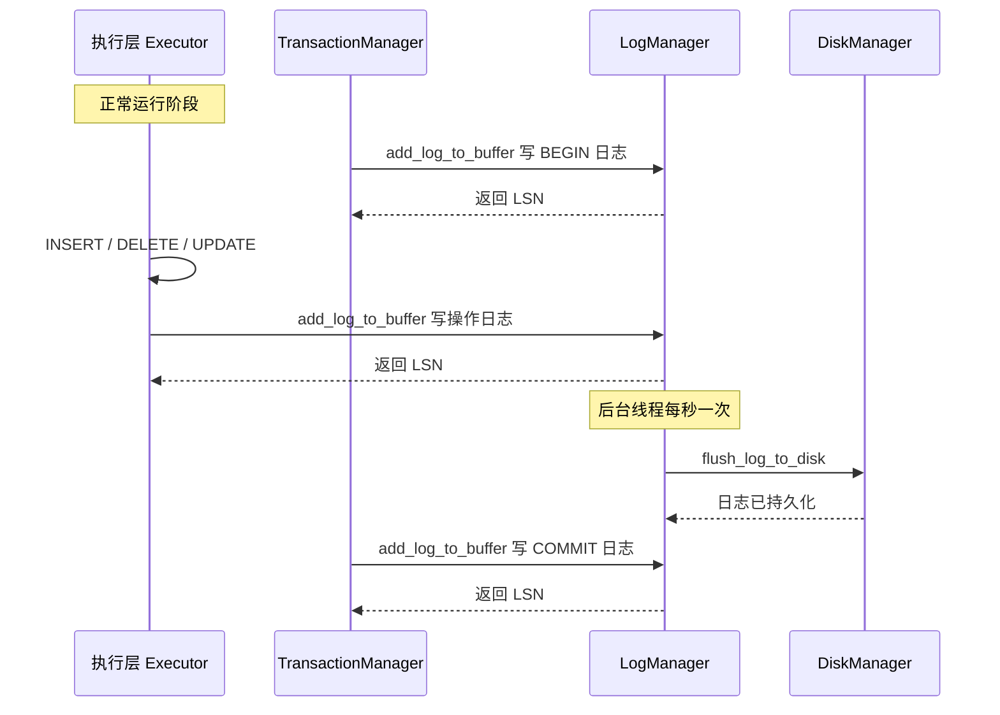
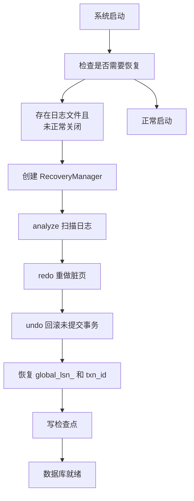

# 恢复层组件交互

## 交互总览

**含义**：恢复层不是独立运行的——日志写入由事务层和执行层驱动，崩溃恢复由系统启动过程触发。



## 日志写入的触发路径

**含义**：日志写入有两个触发路径——事务生命周期事件和操作记录。

**作用**：事务层保证状态变化的原子性被记录，执行层保证数据变化可以被恢复。

| 调用位置 | 日志类型 | 调用方法 |
|----------|---------|---------|
| TransactionManager::begin | BEGIN | `log_manager->add_log_to_buffer(begin_log_record)` |
| InsertExecutor | INSERT | `context->log_manager_->add_log_to_buffer(insert_log_record)` |
| DeleteExecutor | DELETE | `context->log_manager_->add_log_to_buffer(delete_log_record)` |
| UpdateExecutor | UPDATE | `context->log_manager_->add_log_to_buffer(update_log_record)` |
| TransactionManager::commit | COMMIT | `log_manager->add_log_to_buffer(commit_log_record)` |
| TransactionManager::abort | ABORT | `log_manager->add_log_to_buffer(abort_log_record)` |
| 回滚过程中的反向操作 | INSERT/DELETE/UPDATE | `log_manager->add_log_to_buffer(相应日志)` |

**示例**：执行 `INSERT INTO student VALUES (2, 'Bob', 22)` 时，InsertExecutor 先写 INSERT 日志到缓冲区，再实际写入记录到数据页。

## 崩溃恢复的启动流程

**含义**：系统重启时检测到的恢复入口在 `rmdb.cpp` 或系统初始化逻辑中。



## 恢复时如何对接各层

**含义**：RecoveryManager 持有所有必要模块的指针，恢复过程中直接调用它们的接口。

```cpp
// src/recovery/log_recovery.h:29-38
RecoveryManager(DiskManager* disk_manager,
                BufferPoolManager* buffer_pool_manager, SmManager* sm_manager,
                LogManager* log_manager,
                TransactionManager* transaction_manager)
```

| 持有的指针 | 在恢复中的用途 |
|-----------|--------------|
| `disk_manager_` | 读取日志文件、写入日志文件 |
| `buffer_pool_manager_` | 在 analyze 阶段 pin/unpin 页面以检查页 LSN |
| `sm_manager_` | 获取表元数据和索引元数据、访问记录文件句柄和索引句柄 |
| `log_manager_` | 恢复 `global_lsn_` 和 `persist_lsn_` 到崩溃前状态 |
| `transaction_manager_` | 恢复 `next_txn_id_` 到崩溃前状态 |

**示例**：redo 重做 DELETE 时，`sm_manager_->fhs_` 提供表文件句柄，`sm_manager_->ihs_` 提供索引句柄，`sm_manager_->db_` 提供表和索引元数据。

## 日志链路的完整流程

**含义**：一条 UPDATE 操作从执行到可恢复经过三个模块。


**示例**：用户执行 `UPDATE student SET age = 20 WHERE id = 1`，日志从构造到写入只需 `add_log_to_buffer` 一次调用；但在崩溃恢复时，这条日志被 analyze 发现、redo 重做、或者因为事务所属事务未提交而被 undo 撤销。

## 日志与事务写集的区别

**含义**：日志和事务写集都记录了修改内容，但用途不同。

**为什么需要两份**：写集存在内存中，事务提交或回滚后就释放了——它只为运行时 abort 服务。日志持久化到磁盘，系统崩溃重启后还能读取——它为跨系统重启的恢复服务。如果只有写集没有日志，正常运行中的回滚能做，但一掉电所有未提交事务就丢了；如果只有日志没有写集，abort 时必须重新翻磁盘上的日志文件才能找到需要反向的操作，比直接从内存队列逆序遍历慢得多。

| 维度 | 日志 LogRecord | 写集 WriteRecord |
|------|---------------|-----------------|
| 用途 | 崩溃恢复 | 事务运行时回滚 |
| 存储位置 | 日志缓冲区 → 磁盘日志文件 | 事务对象的 `write_set_` 内存队列 |
| 生命周期 | 持久化到磁盘，跨系统重启存在 | 事务提交或回滚后释放 |
| 记录内容 | 完全相同的旧值/新值信息 | 完全相同的旧值/新值信息 |
| 回滚方向 | undo 逆序遍历，与 abort 相同 | abort 逆序遍历 |

**示例**：abort 和崩溃恢复的 undo 做的事情是一样的——INSERT 变 DELETE、DELETE 变 INSERT、UPDATE 恢复旧值——只是触发场景不同。

上一节：[04-recovery-manager.md](./04-recovery-manager.md) | 下一节：[06-recovery-frame-vs-reference.md](./06-recovery-frame-vs-reference.md)
