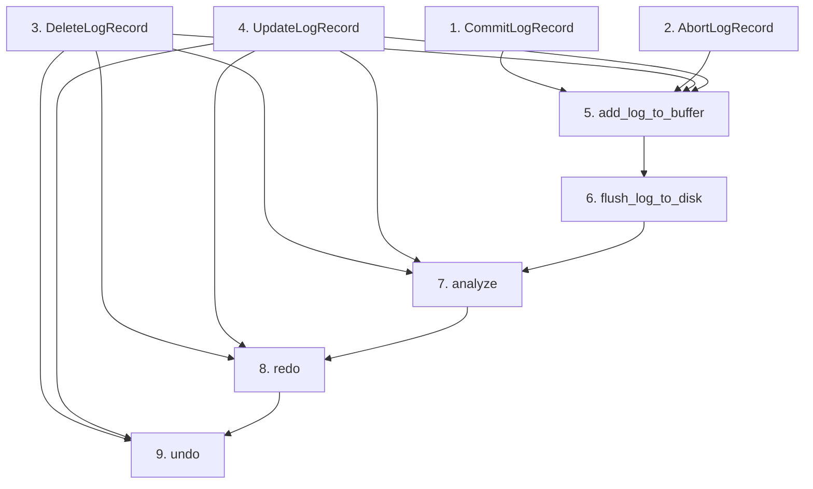

# 框架与参考实现对比

## 本篇目的

**含义**：本文把 `db2026-x/src/recovery/` 中的待实现内容与 `src/recovery/` 的参考实现逐项对应。

**作用**：帮助框架实现者快速定位要写的代码和参考实现位置。

**用法**：按序号顺序实现，每完成一项编译验证。

## 1. CommitLogRecord

**位置**：`db2026-x/src/recovery/log_manager.h:102-103`

**框架现状**：空类，只有一个类声明。

**要做什么**：补全 CommitLogRecord 的构造函数、序列化和反序列化。

**参考实现**：`src/recovery/log_manager.h:130-152`

**核心步骤**：
- 构造函数中设置 `log_type_ = COMMIT`，`log_tot_len_ = LOG_HEADER_SIZE`
- serialize 直接调用基类的 LogRecord::serialize
- deserialize 直接调用基类的 LogRecord::deserialize

## 2. AbortLogRecord

**位置**：`db2026-x/src/recovery/log_manager.h:109-111`

**框架现状**：空类。

**要做什么**：补全 AbortLogRecord 的构造函数、序列化和反序列化。

**参考实现**：`src/recovery/log_manager.h:157-179`

**核心步骤**：与 CommitLogRecord 结构完全一致，只是 `log_type_ = ABORT`。

## 3. DeleteLogRecord

**位置**：`db2026-x/src/recovery/log_manager.h:180-188`

**框架现状**：空类。

**要做什么**：补全 DeleteLogRecord 的构造函数、序列化和反序列化。

**参考实现**：`src/recovery/log_manager.h:258-330`

**核心步骤**：
- 构造函数接收 `txn_id`、`RmRecord&`、`Rid&`、`table_name`
- 构造时设置 `delete_value_`、`rid_`、`table_name_`
- 计算 `log_tot_len_`：头加记录大小、Rid 大小、表名大小
- 序列化时依次写入 `delete_value_.size`、`delete_value_.data`、`rid_`、`table_name_size_`、`table_name_`

## 4. UpdateLogRecord

**位置**：`db2026-x/src/recovery/log_manager.h:187-188`

**框架现状**：空类。

**要做什么**：补全 UpdateLogRecord 的构造函数、序列化和反序列化。

**参考实现**：`src/recovery/log_manager.h:335-416`

**核心步骤**：
- 构造函数接收 `txn_id`、`old_value`、`update_value`、`rid`、`table_name`
- 同时保存旧值和新值两个 RmRecord
- 序列化时依次写入 `old_value_.size`、`old_value_.data`、`update_value_.data`、`rid_`、`table_name_size_`、`table_name_`

## 5. LogManager::add_log_to_buffer

**位置**：`db2026-x/src/recovery/log_manager.cpp:18-20`

**框架现状**：空方法。

**要做什么**：实现日志追加到缓冲区。

**参考实现**：`src/recovery/log_manager.cpp:19-29`

**核心步骤**：
- 用 `latch_` 加锁保护
- 如果缓冲区已经满（`log_buffer_.is_full(log_record->log_tot_len_)`），先刷盘
- 给日志分配 `lsn_ = global_lsn_++`
- 调用 `log_record->serialize(log_buffer_.buffer_ + log_buffer_.offset_)`
- 更新 `buffer_.offset_`
- 解锁并返回 `lsn_`

## 6. LogManager::flush_log_to_disk

**位置**：`db2026-x/src/recovery/log_manager.cpp:25-27`

**框架现状**：空方法。

**要做什么**：实现缓冲区刷到磁盘。

**参考实现**：`src/recovery/log_manager.cpp:35-43`

**核心步骤**：
- 如果 offset 为 0，直接返回
- 调用 `disk_manager_->write_log(log_buffer_.buffer_, log_buffer_.offset_)`
- 重置 offset 为 0
- 更新 `persist_lsn_ = global_lsn_ - 1`

## 7. RecoveryManager::analyze

**位置**：`db2026-x/src/recovery/log_recovery.cpp:15-17`

**框架现状**：空方法。

**要做什么**：实现日志文件扫描分析阶段。

**参考实现**：`src/recovery/log_recovery.cpp:19-205`

**核心步骤**：
- 循环调用 `disk_manager_->read_log` 逐块读入日志文件
- 对每一条日志：读取 log_tot_len_ 判断完整性，读取 log_type_ 分支处理
- BEGIN 日志插入 `active_txn_`
- COMMIT/ABORT 日志删除 `active_txn_` 对应事务
- INSERT/DELETE/UPDATE 日志更新 `active_txn_`，检查页 LSN 决定是否加入 `dirty_page_table_`
- 所有日志记录到 `lsn_mapping_`
- 维护 `max_lsn` 和 `max_txn_id`
- 最后调用 `log_manager_->set_global_lsn(max_lsn + 1)` 和 `transaction_manager_->set_next_txn_id(max_txn_id + 1)`

## 8. RecoveryManager::redo

**位置**：`db2026-x/src/recovery/log_recovery.cpp:22-24`

**框架现状**：空方法。

**要做什么**：实现重做阶段。

**参考实现**：`src/recovery/log_recovery.cpp:210-298`

**核心步骤**：
- 遍历 `dirty_page_table_` 中的 LSN
- 通过 `lsn_mapping_` 找到每条日志的文件偏移
- 读入日志并反序列化
- INSERT 日志调用 `fh->insert_record` + `ih->insert_entry`
- DELETE 日志调用 `fh->delete_record` + `ih->delete_entry`
- UPDATE 日志调用 `fh->update_record` + 删除旧索引键、插入新索引键

## 9. RecoveryManager::undo

**位置**：`db2026-x/src/recovery/log_recovery.cpp:29-31`

**框架现状**：空方法。

**要做什么**：实现撤销阶段。

**参考实现**：`src/recovery/log_recovery.cpp:305-437`

**核心步骤**：
- 用大根堆（`priority_queue`）维护 `active_txn_` 中所有事务的最大 LSN
- 循环从堆顶取出最大 LSN，读入对应日志
- INSERT 日志 undo 为删除记录和索引项
- DELETE 日志 undo 为重新插入记录和索引项
- UPDATE 日志 undo 为恢复旧记录和索引键
- BEGIN 日志表示该事务链结束
- 每条日志通过 `prev_lsn_` 向前回溯，非 INVALID 的继续加入堆

## 未在框架中出现的功能

- `background_flush` 后台刷盘线程：框架中的 LogManager 没有启动线程，但可以先不实现，通过 `add_log_to_buffer` 中 `is_full` 时主动刷盘即可通过基础测试
- `redo_indexes` 全量索引重建：当前参考实现中也处于注释状态

## 实现顺序建议

**理由**：日志类是所有操作的基础，先完成全部日志类才能正确读写日志文件；add_log_to_buffer 和 flush_log_to_disk 是正常运行的日志写入路径；analyze、redo、undo 是恢复核心，依赖前面全部功能。

上一节：[05-recovery-interaction.md](./05-recovery-interaction.md) | 下一节：[07-recovery-api-reference.md](./07-recovery-api-reference.md)
